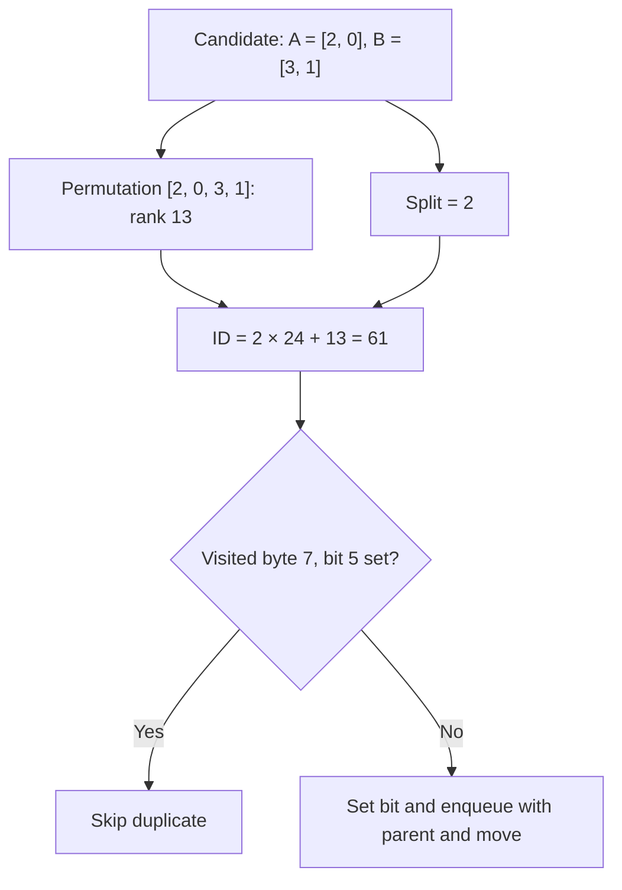

*This project has been created as part of the 42 curriculum by hnah.*

> Update (2026-09-29): seed preparation and candidate management are now separate. `solve()` compares four seed/strategy combinations; BFS experiments are parked under `Brute_force/WIP`. All four candidates share preparation, insertion and alignment stages. See [Seed candidate flow](#seed-candidate-flow).

> Update (2026-09-29): fixed the bundled formatter's shared `va_list` handling, which caused the decoded-move debug printer to crash on Apple Silicon. The best-solution scan now considers only generated solutions (`0` through `x->cur`). See the [library portability update](libft/1_ft_printf/README.md#post-submission-update-portable-variadic-argument-consumption) for details and validation. Three generated runs each at 2, 11, 100, and 500 values completed without a crash; sorting correctness and move-count compliance are separate checks.

<a id="top"></a>

# push_swap — studying sorting through stack operations and shortest paths

<a id="at-a-glance"></a>

## At a glance

✅ = implemented. 🚧 = partial or experimental. ❌ = not met or not implemented.
These describe the current code and study tools; they are not evaluation scores.

**Work in progress: this implementation does not yet meet the subject's move
requirements.** The repository already contains stack operations, a BFS search,
chunk-extraction experiments, and saved analysis data. Those are useful building
blocks, but they do not establish a compliant or efficient final solver.

| Status | Feature | Current behavior |
|---|---|---|
| 🚧 | Integer input | Parses separate arguments and space-separated strings; includes sign, range, duplicate and 500-value checks. Edge cases still need correction and validation. |
| ✅ | Rank normalisation | Replaces each distinct value with its position in sorted order. |
| ✅ | Circular-buffer stacks | Stores A and B in fixed arrays with wrapping read/write indices. |
| ✅ | Operation implementations | Swap, push, rotate, reverse rotate and combined-operation functions are present, alongside BFS state transformations. |
| ✅ | BFS state indexing | Uses a Lehmer permutation rank plus the A/B split and a visited bitset. |
| 🚧 | Chunk solver | Extracts rank intervals and replays a restricted BFS solution for each active chunk. This remains an experimental path. |
| ✅ | Seed comparison | Three-value and circular-LIS seeds each run with local greedy and lookahead; the first shortest of four candidates is printed. BFS experiments remain in WIP. |
| ✅ | Study tools | Includes a permutation analyser, a reverse-BFS shortest-path analyser and an input generator. |
| ✅ | Saved study data | Reports and trial logs are preserved in Git under [`debug/results/`](debug/results/). |
| ✅ | Build organisation | Bundled libft, separate source/header directories, ignored build products and incremental builds. |
| ❌ | Subject move requirements | Not met yet; no passing 100/500-number benchmark is claimed. |
| ✅ | Clean instruction-only output | The active candidate solver prints the selected moves to stdout; debug diagnostics go to stderr. |
| ❌ | Bonus checker implementation | The supplied Linux checker is a reference binary, not a checker written for this project. |

[↑ Back to top](#top)

<a id="design-choices-and-edge-cases"></a>

## Design choices and edge cases

| Status | Choice | Why it matters |
|---|---|---|
| ✅ | [Normalise before searching](#rank-normalisation) | Relative order determines sorting; original integer magnitudes need not appear in BFS states. |
| ✅ | [Circular buffers](#circular-buffer-stacks) | Stack operations reuse fixed storage without allocating nodes for each move. |
| ✅ | [Encode states directly](#bfs-and-state-indexing) | A permutation and split identify both stacks, allowing direct visited-bit lookup. |
| 🚧 | [Protect the hidden part of A](#chunk-extraction-and-the-hidden-stack) | Restricts the active search so a chunk can be considered separately from the rest of the stack. |
| 🚧 | [Compare extraction routes](#chunk-extraction-and-the-hidden-stack) | Tries both initial rotation directions and at most one direction change; this is not a global optimality proof. |
| ✅ | [Reverse BFS for study](#analysis-tools-and-study-data) | Reuses distances from the goal to enumerate shortest solutions for small permutations. |
| ❌ | [Submission edge cases](#current-limitations) | Output, trivial inputs, parser safety, memory handling and compliance still need work. |

[↑ Back to top](#top)

<a id="contents"></a>

## Contents

- [At a glance](#at-a-glance)
- [Design choices and edge cases](#design-choices-and-edge-cases)
- [Description](#description)
- [Instructions](#instructions)
- [Rank normalisation](#rank-normalisation)
- [Why radix as my basic algo?](#why-radix)
- [LIS, LDS and the square-root guarantee](#lis-lds-guarantee)
- [Circular-buffer stacks](#circular-buffer-stacks)
- [Greedy lookahead: who owns each plan?](#greedy-lookahead-who-owns-each-plan)
- [BFS and state indexing](#bfs-and-state-indexing)
- [Chunk extraction and the hidden stack](#chunk-extraction-and-the-hidden-stack)
- [Analysis tools and study data](#analysis-tools-and-study-data)
- [Checks and current limitations](#checks-and-current-limitations)
- [Resources and use of AI](#resources)

[↑ Back to top](#top)

<a id="description"></a>

## Description

Push_swap explores sorting with two stacks and a limited vocabulary of moves.
The intended result is an ascending stack A, an empty stack B, and a short list
of instructions that reproduces the sort.

This version is also a study of the search space: how to represent a state,
recognise a state already visited, recover a path, and use small optimal solutions
to investigate larger sorting strategies. The saved reports are reference material
for that investigation, including cases with several equally short solutions.

The main program currently runs the experimental chunk solver unconditionally.
The small-case alternative in `solve.c` exists, but is bypassed by that early
return. The sections below distinguish the active solver from the analysis tools.

[↑ Back to top](#top)

<a id="instructions"></a>

## Instructions

Run these commands from the project directory. Building requires `make`, a C
compiler available as `cc`, and `ar`. The Makefile builds the bundled `libft/`
automatically; no sibling checkout or extra library copy is needed.

### Build and clean

```sh
make                      # ./push_swap
make debug                # bin/push_swap_debug
make analyse_bfs          # bin/bfs_analyser
make analyse_bfs_all_paths # bin/bfs_all_paths
make generator            # bin/generator
make clean
make fclean
make re
```

`make debug` defines `BFS_DEBUG` and links the logging helper. The logging call
in the old BFS implementation is currently commented out, so this target does
not guarantee a separate report. The ordinary executable already prints diagnostics.

`make clean` removes project and libft objects. `make fclean` also removes built
executables and the library archive. Both preserve study reports and the supplied
checker. Repeated builds leave unchanged executables alone.

### Run the development solver

```sh
./push_swap 3 2 1
./push_swap "3 2 1"
./bin/generator 5
```

Start with small inputs. The current BFS reserves space for the configured maximum
state count even for a small problem; larger searches can be expensive.
Output contains both instructions and diagnostics, so piping it directly to the
checker or counting all stdout lines does not provide a valid subject benchmark.

### Project layout

| Path | Purpose |
|---|---|
| [`src/`](src/) | Solver, parsing, stack operations and BFS implementation. |
| [`includes/push_swap.h`](includes/push_swap.h) | Shared structures, limits and function declarations. |
| [`libft/`](libft/) | Self-contained library sources used by this project. |
| [`debug/`](debug/) | Analysis and generator sources. |
| [`debug/results/`](debug/results/) | Study reports and trial logs, kept in Git. |
| [`tests/checker_linux`](tests/checker_linux) | Supplied Linux checker binary. |
| [`notes.md`](notes.md) | Working questions, ideas and unfinished plans. |
| `obj/`, `bin/`, `push_swap` | Generated build products, ignored by Git. |

The `DO_NOT_SUBMIT` name on `src/DO_NOT_SUBMIT_DEBUG_hidden_bfs.c` reflects its
experimental role; it is still a dependency of the main build.

[↑ Back to top](#top)

<a id="rank-normalisation"></a>

## Rank normalisation

[`rank_values.c`](src/rank_values.c) counts how many input values are smaller
than each value. For distinct inputs, that gives ranks from `0` to `n - 1`:

```text
values:  40  -8  12
ranks:    2   0   1
```

The ordering is preserved, so the same stack moves sort either representation.
The current implementation compares every value with every other value, taking
O(n²) time. Small BFS states store normalised ranks as unsigned bytes; the main
stacks still store integers.

[↑ Back to top](#top)

<a id="why-radix"></a>

## Why radix as my basic algo?

So the plan now is to implement radix as my **basic algo** first. I've already
experimented with BFS, but taking those ideas further can come later. First I
want a straightforward sort working and to understand why its moves work.

What confused me was: why radix? Why can't I just use insertion sort, merge
sort, or another divide-and-conquer algo?

Actually, I can. With a normal array, though, I can access whatever position I
want. In `push_swap`, even if I know exactly where a number belongs, I still
have to get it there using pushes, swaps and rotations. That movement is what
costs me. Spending more time thinking about a move can be worth it if I end up
printing fewer operations.

Insertion sort can translate into rotating to the right position and pushing
a number in. Merge sort is possible too. I initially wondered whether reverse
rotation or access to the end of the array breaks it, but that's not really the
issue: managing the sorted runs and reaching the next element of each run takes
more work with stacks. Partitioning around a pivot is possible as well; I just
have to manage those partitions through the allowed operations.

Radix happens to fit these operations quite naturally. First, **ranks let me
ignore how big the actual numbers are**:

```text
Values:  -40   900   7   120
Ranks:     0     3   1     2
```

I'm basically saying: "I don't care that this number is 900. I care that it's
the biggest of these four."

Sorting the ranks gives the same order as sorting the original values. But now,
instead of dealing with negatives and potentially huge numbers, I've got a tidy
range from `0` to `n - 1`. That keeps the number of binary digits I need to
process small.

Then radix goes through those ranks **one bit at a time**, starting from the
rightmost bit. Each pass splits them into two groups: current bit is `0`, or
current bit is `1`.

So my "two classes" aren't really small indices versus large indices. The groups
change depending on which bit I'm looking at. On the first pass, for example,
I'm separating evens from odds.

That's where the two stacks come in handy: I can push one group to B and rotate
the other group within A. Then I bring B back. Done properly, each group keeps
its relative order, so the next bit's pass builds on the previous pass instead
of undoing it. Pushing a group to B reverses its order, and pushing it all back
reverses it again.

So ranks make the numbers convenient to work with, and radix gives me a
repetitive process that fits the stack operations. It's a good basic algo
because it's straightforward and predictable, with O(n log n) stack operations
for the usual binary passes. That doesn't mean it gives the fewest moves.
Getting this baseline working comes first; exploring greedy move costs and
more BFS ideas comes later.

[↑ Back to top](#top)

<a id="lis-lds-guarantee"></a>

## LIS, LDS and the square-root guarantee

A subsequence can skip intervening numbers, but keeps their original relative
order. So in `1 8 2 9 3 4`, I can keep `1 2 3 4` as an increasing subsequence.
LIS means longest increasing subsequence; LDS means longest decreasing subsequence.

The **Erdős–Szekeres theorem** says that, for positive integers $r$ and $s$, any
sequence of distinct numbers with length

```math
n \geq (r - 1)(s - 1) + 1
```

contains an increasing subsequence of length at least $r$, **or** a decreasing
subsequence of length at least $s$.
See [the theorem statement in this research paper](https://www.sciencedirect.com/science/article/am/pii/S0195669821001505).

Taking equal thresholds gives the square-root guarantee:

```math
\max\bigl(\mathrm{LIS}(A),\mathrm{LDS}(A)\bigr)
\geq \left\lceil\sqrt{n}\right\rceil.
```

For my 500-number input:

```math
\begin{gathered}
(23 - 1)^2 + 1 = 485 \leq 500 \\
\left\lceil\sqrt{500}\right\rceil = 23. 
\end{gathered}
```

So yes, there must be an LIS **or** LDS of at least 23 elements. The catch is
that I don't get to choose which one the theorem guarantees. A completely
descending input has

```math
\begin{gathered}
\mathrm{LIS}(A) = 1 \\
\mathrm{LDS}(A) = 500. 
\end{gathered}
```

For my planned LIS preparation, I'll keep an increasing subsequence in A and
push the rest to B before greedy reinsertion. This theorem alone doesn't
guarantee that I can keep 23 elements in A: the long subsequence might be
decreasing. It also doesn't promise a particular push_swap move count.

### Why keep the longest seed?

What makes a useful seed for my reinsertion algo? Once I've pushed the other
elements to B, the elements kept in A must be circularly ascending. An increasing
subsequence gives me that property. It doesn't need consecutive ranks or a `0`
at the start: greedy reinsertion can fill the gaps later.

Suppose I start with $n$ elements in A and empty B, and keep a seed $S$ of
length $k$. If I push each remaining element to B exactly once, then return
each to A exactly once, the push count is

```math
P(S) = \underbrace{(n-k)}_{\mathrm{pb}}
     + \underbrace{(n-k)}_{\mathrm{pa}}
     = 2(n-k).
```

So every extra element I keep saves exactly two pushes under this strategy:

```math
P(k+1)-P(k)=-2.
```

That's my mathematical reason for starting with LIS: among ordinary increasing
subsequence seeds, choosing the longest one minimises this push count. It is
not a lower bound for every possible push_swap algorithm; other strategies
can use swaps or different transfers.

For example, both seeds below have length 9 and require just two pushes:

```text
Input: 0 1 2 8 4 9 10 11 12 13
Keep:  0 1 2 8   9 10 11 12 13   -> move 4 out and back
Keep:  0 1 2   4 9 10 11 12 13   -> move 8 out and back
```

The catch is rotations. If $R(S)$ counts the rotation instructions for
extraction, reinsertion and final alignment (with `rr` or `rrr` counting as one
instruction), this push-and-rotate strategy has total cost

```math
M(S)=2(n-|S|)+R(S).
```

A longer seed reduces the first term, but can change the second. So LIS is a
justified starting heuristic, not proof of the fewest total moves. For now,
I'll keep the first longest seed I find; comparing rotation costs between
seeds can come later. Circular seed selection can also retain more than an
ordinary LIS: `8 9 0 1 2` is already circularly ascending as a whole.

[↑ Back to top](#top)

<a id="circular-buffer-stacks"></a>

## Circular-buffer stacks

Each stack has an integer array, a capacity, a read index and a write index.
The indices wrap around the array. One spare slot distinguishes a full buffer
from an empty one, so `n` input values use a capacity of `n + 1`.

The circular-buffer helpers implement the underlying movements. The
`stack_operation_*.c` wrappers also append an encoded move to the solution.
The output helper translates those codes back to names such as `sa`, `pb` and
`rra`, one instruction per line. The solver's additional diagnostic prints are
what currently prevent the complete output from being instruction-only.

[↑ Back to top](#top)

<a id="bfs-and-state-indexing"></a>

## BFS and state indexing

### Lehmer ranking: give every state an exact address

**Lehmer ranking replaces searching through previously discovered states with
calculating a unique integer ID and checking one bit.** It identifies a
permutation exactly; it does not estimate its distance from sorted order.

The implementation is
[bfs_optimiser_lehmer_rank.c](src/sorting_algorithms/Brute_force/BFS/bfs_optimiser_lehmer_rank.c).
A state stores A followed by B, both top to bottom, with a split recording the
number of elements in A. The BFS representation uses distinct small local ranks
$0,\ldots,n-1$.

| Component | Example |
| --- | --- |
| A, top first | 2, 0 |
| B, top first | 3, 1 |
| Combined permutation $p$ | $(2,0,3,1)$ |
| Split (number of elements in A) | 2 |

### Why factorials appear

There are $n!$ permutations of $n$ distinct values. In lexicographic order, each
possible first value heads a block of $(n-1)!$ permutations. After fixing it,
each possible second value heads a block of $(n-2)!$, and so on.

Factorials are **block sizes used to calculate an address**. The calculation
does not generate every permutation.

For each position $i$, count the smaller values to its right:

```math
\begin{gathered}
c_{i}=\#\lbrace j:i\lt j\lt n,\ p_{j}\lt p_{i}\rbrace \\
0\le c_{i}\le n-1-i. 
\end{gathered}
```

Here, `#` means the number of elements in the set (its cardinality).

These digits form the **Lehmer code**. Their factorial-weighted sum gives the
zero-based permutation rank:

```math
\begin{gathered}
R(p)=\sum_{i=0}^{n-1}c_{i}(n-1-i)! \\
0\le R(p)\lt n!. 
\end{gathered}
```

This is a mixed-radix representation: unlike decimal digits, the allowed digit
range shrinks at each position. Remember $0!=1$; the last digit is always zero.

For $p=(2,0,3,1)$:

| Position | Value | Smaller values to the right | Digit | Weight | Contribution |
| ---: | ---: | --- | ---: | ---: | ---: |
| 0 | 2 | 0, 1 | 2 | $3!=6$ | 12 |
| 1 | 0 | None | 0 | $2!=2$ | 0 |
| 2 | 3 | 1 | 1 | $1!=1$ | 1 |
| 3 | 1 | None | 0 | $0!=1$ | 0 |

```math
\begin{aligned}
R(2,0,3,1)&=2\cdot3!+0\cdot2! \\
&\quad+1\cdot1!+0\cdot0! \\
&=13.
\end{aligned}
```

There are 12 permutations beginning with 0 or 1, plus one earlier permutation
within the chosen prefix: $(2,0,1,3)$. Thus $(2,0,3,1)$ has rank 13.

### Why permutations cannot collide

The factorial blocks do not overlap. To recover the permutation from its code,
start with the sorted unused values, select the value at zero-based index $c_i$,
and remove it:

| Digit | Unused values before selection | Selected value |
| ---: | --- | ---: |
| 2 | 0, 1, 2, 3 | 2 |
| 0 | 0, 1, 3 | 0 |
| 1 | 1, 3 | 3 |
| 0 | 1 | 1 |

This uniquely recovers $(2,0,3,1)$. Ranking is reversible and collision-free for
valid permutations. It is not a hash with possible collisions. The implementation
only needs the ranking direction, not decoding.

### Include the stack split

The same permutation with a different split represents different stacks.
Reserve a block of $n!$ IDs for each split:

```math
\begin{gathered}
\mathrm{ID}(p,s)=s\,n!+R(p) \\
s\in\{0,\ldots,n\}. 
\end{gathered}
```

For our example:

```math
\begin{gathered}
n=4,\quad s=2,\quad R=13 \\
\mathrm{ID}=2\cdot24+13=\boxed{61}. 
\end{gathered}
```

| Split | Meaning | ID range for $n=4$ |
| ---: | --- | --- |
| 0 | A empty | 0–23 |
| 1 | One element in A | 24–47 |
| 2 | Two elements in A | 48–71 |
| 3 | Three elements in A | 72–95 |
| 4 | B empty | 96–119 |

There are $n+1$ possible splits, so the number of encodable states is:

```math
\begin{gathered}
N=(n+1)n!=(n+1)! \\
0\le\mathrm{ID}\lt N. 
\end{gathered}
```

Equivalently, choose which $s$ elements go into A, then order both stacks:

```math
\begin{aligned}
N&=\sum_{s=0}^{n}\binom{n}{s}s!(n-s)! \\
 &=\sum_{s=0}^{n}n! \\
 &=(n+1)!.
\end{aligned}
```

This counts all encodable states; the restricted BFS need not visit them all.

### From an ID to a visited bit

The BFS stores one visited bit per ID:

```math
\begin{gathered}
\text{byte index}=\left\lfloor\frac{\mathrm{ID}}8\right\rfloor \\
\text{bit offset}=\mathrm{ID}\bmod8. 
\end{gathered}
```

For ID 61, that is byte 7, bit 5 (both zero-based).

> **AI-generated diagram:** The Mermaid diagram below was generated by ChatGPT/Codex; I did not draw or write the diagram myself. I worked through this project's algorithm design and process together with AI in earlier discussions. The diagram documents that implementation; it does not imply that I invented Lehmer ranking. See [Use of AI](#use-of-ai) for the scope of AI assistance, including debugging and diagnostic printing tools.



The bit operations used in the BFS are:

```c
/* Check whether this state was already discovered. */
visited[state_id / 8] & (1 << (state_id % 8))

/* Mark it as discovered. */
visited[state_id / 8] |= (1 << (state_id % 8));
```

With unit-cost moves, BFS first discovers a state at minimum depth within its
explored graph. Later routes to the identical state need not enqueue it again:
the available continuations depend on that state, not the route taken to it.
Each discovered node records its parent and incoming move so the final path
can be reconstructed backwards.

### What the optimization saves

The old duplicate check scanned previously discovered nodes and compared their
arrays. With $V$ stored states and $n$ values, this takes up to $O(Vn)$ work per
candidate. The current nested-loop ranking performs exactly

```math
\frac{n(n-1)}2
```

value comparisons, then one bit lookup.

| Method | Worst-case duplicate-check work per candidate |
| --- | --- |
| Scan previously discovered states | $O(Vn)$ |
| Current Lehmer ranking plus visited bit | $O(n^2)+O(1)$ |

For $n=10$, ranking makes 45 value comparisons regardless of whether BFS has
discovered 100 states or one million. Only the bit lookup is $O(1)$; the complete
rank-and-check operation is $O(n^2)$.

The implementation precomputes factorials in its lookup table. It does not
enumerate $n!$ permutations to compute a rank. The speedup comes from eliminating
the growing scan of stored states. This is separate from greedy branch-and-bound
pruning, which skips branches based on cost.

### Limits: indexing does not remove factorial growth

The visited bitset requires

```math
\left\lceil\frac{(n+1)!}{8}\right\rceil
```

bytes. With the configured maximum of 10 elements, $11!=39,916,800$ states need
4,989,600 bytes (about 4.76 MiB) for visited bits alone. The node array containing
states, parents and moves needs additional, much larger storage. The current
BFS allocates its configured maximum tables even for smaller calls. Increasing
the limit also requires checking integer ranges and representation limits.

The BFS implementation tries only sa, sb, pa, pb, ra and rra, with additional
restrictions protecting hidden values in A. Its shortest-path guarantee applies
to that restricted graph, not all eleven push_swap operations. Lehmer ranking
preserves state identity without changing those search rules.

[↑ Back to top](#top)

<a id="chunk-extraction-and-the-hidden-stack"></a>

## Chunk extraction and the hidden stack

The active development path processes successive rank intervals of up to ten
values. It first moves the selected interval from A to B, then creates temporary
stacks containing the active chunk, searches for a solution and replays that
solution on the real stacks.

[`chunk_extract_optimal.c`](src/chunk_extract_optimal.c) simulates extraction
routes before executing one. It tries each initial rotation direction and each
point at which to reverse direction after collecting a target value. It chooses
the lowest rotation-plus-push cost among those candidates.

“Optimal” here refers only to that limited family of extraction routes. The code
does not compare arbitrary direction changes or the total future sorting cost.
Likewise, a short BFS solution for one chunk does not prove that the full sequence
meets the subject's move requirements.

The search treats the unseen portion of A as a boundary: it disallows A rotations
when the visible portion is nonempty and disallows `sa` when fewer than two visible
values are available. This is the experiment behind “hidden BFS”. Its overall
correctness and efficiency still need broader validation.

[↑ Back to top](#top)

<a id="analysis-tools-and-study-data"></a>

## Analysis tools and study data

The two analysis executables accept an `n` from 2 to 7 and write timestamped
reports into their working directory. For a small reverse-BFS study:

```sh
make analyse_bfs_all_paths
mkdir -p debug/results
(cd debug/results && ../../bin/bfs_all_paths 3)
```

The reverse analyser builds distances from the sorted goal, uses all eleven
operations, and enumerates shortest paths by following moves that reduce the
remaining distance. This differs from the restricted search in the main solver.

The permutation analyser can be run with
`(cd debug/results && ../../bin/bfs_analyser 3)` after `make analyse_bfs`.
It calls the current `brute_solve`, so its results depend on the current search
restrictions. Historical reports can reflect an earlier version of the search.

| Saved material | What to study |
|---|---|
| [`debug/results/`](debug/results/) | All preserved BFS reports and 500-number trial logs. |
| [All shortest paths, n = 5](debug/results/push_swap_bfs_all_paths_n5_2026-08-24_22-02-49.txt) | The report records 120 starting permutations, 720 graph states and a maximum optimal distance of 9. |
| [All shortest paths, n = 7](debug/results/push_swap_bfs_all_paths_n7_2026-08-24_22-02-53.txt) | The report records 5,040 starting permutations, 40,320 graph states and a maximum optimal distance of 13. |
| [`notes.md`](notes.md) | Questions about pattern discovery, heuristics and how small solutions might inform larger cases. |

These numbers describe the saved reports, not a fresh evaluation of the current
executable. The reports are important study data and are **not ignored**. Build
cleanup does not delete them. Larger all-path reports can grow quickly because
one starting permutation may have many equally short solutions.

[↑ Back to top](#top)

<a id="checks-and-current-limitations"></a>

## Checks and current limitations

### Build checks

The following checks passed during the directory reorganisation. They establish
build behavior, not sorting correctness or a subject score.

| Result | Check |
|---|---|
| ✅ | Main executable and all four development tools build with `-Wall -Wextra -Werror`. |
| ✅ | Repeating all build targets leaves executable and archive timestamps unchanged. |
| ✅ | `make clean` removes objects while preserving executables. |
| ✅ | `make fclean` removes build products while preserving the checker and all 17 existing study reports. |
| ✅ | All targets rebuild after cleanup. |
| ✅ | Deleted main and analyser executables are recreated. |

<a id="current-limitations"></a>

### Current limitations

The next milestone is a correct, compliant instruction stream, followed by
measured move-count improvements. Outstanding work includes:

- Meeting the subject's move requirements and recording reproducible benchmarks.
- Removing solver diagnostics from stdout and checking results with the supplied checker.
- Correct handling of trivial inputs: one integer currently prints `Error`, and sorted input has no early exit before the chunk solver.
- Hardening parsing. A non-space character immediately after digits can leave the count unchanged before an array write; long strings of leading zeroes also hit the digit-count limit.
- Completing allocation-failure handling and solution cleanup; no leak-free result is claimed.
- Reducing the fixed maximum-size BFS allocation and validating chunk replay across larger inputs.
- Reviewing Norm, allowed functions and global variables before submission. A successful build is not a compliance check.

[↑ Back to top](#top)

<a id="resources"></a>

## Resources

- [aleksify — pushswap-research](https://github.com/aleksify/pushswap-research) explores move-sequence optimisation and BFS-based superoptimisation. Its **Further research TODO list** proposes bounded lookahead with beam search or Monte Carlo Tree Search and discusses the difficulty of scoring intermediate stack states. Useful inspiration for testing lookahead in greedy reinsertion; those proposed approaches are not benchmark evidence that two-insertion lookahead, circular-LDS preparation, or their combination will improve this solver.
- [A. Yigit Ogun — Push Swap: A journey to find most efficient sorting algorithm](https://medium.com/@ayogun/push-swap-c1f5d2d41e97) introduces the Turk algorithm. Related reference for my greedy reinsertion approach: both choose transfers by move cost, but mine applies that choice when returning elements from B into circularly sorted A.
- [Working notes](notes.md) and [saved study reports](debug/results/) document the investigation and examples.
- [Bundled libft documentation](libft/README.md) describes the shared library.
- [Pipex README](../2_pipex/README.md) provides the structure used here: feature status, design explanations, reproducible commands and explicit limitations.
- Harvard CS50 lectures by David J. Malan, peer discussions and debugging references contributed to the broader learning process recorded in the previous README.

### Use of AI

I use ChatGPT/Codex for explanations, alternative approaches and tradeoffs, and
help when I am stuck. I bring questions, ideas and deductions into the discussion
and work through the reasoning with AI. This project's algorithm design and
process were developed through that collaboration; established methods such as
Lehmer ranking are not my invention.

AI generated the Lehmer-ranking Mermaid diagram and helped write the mathematical
explanation in this README. I did not create that diagram myself. Its attribution
is also placed beside the diagram so readers do not mistake it for unaided work.

AI assistance also includes the debugging and diagnostic printing tools, test
harnesses and experimental comparisons, mechanical editing, file organisation,
build checks, and documentation. These supporting tools help me inspect behaviour
and test ideas; their output is not proof that the solver is correct or ready
for evaluation.

My aim is to understand and explain the implementation, rather than present an
unexplained generated solution as my own. This follows the distinction described
in my [Pipex README's Use of AI section](../2_pipex/README.md#use-of-ai): the
learning discussion and my own reasoning are distinguished from AI-assisted
mechanical work, testing and documentation.

[↑ Back to top](#top)

## Seed candidate flow

`solve()` loops over `t_algorithm`; `ALGO_COUNT` controls allocation, iteration
and the total shown by diagnostics. The configuration table in
`src/algorithm_config.c` defines each algorithm's seed, insertion depth and name:

| ID | Algorithm | Seed | Insertion |
| --- | --- | --- | --- |
| 1/3 | `ALGO_LIS_LOCAL` | Circular LIS | Local greedy |
| 2/3 | `ALGO_THREE_LOCAL` | Three elements | Local greedy |
| 3/3 | `ALGO_LIS_LOOKAHEAD` | Circular LIS | Lookahead at `LOOKAHEAD_DEPTH` depth |

The fourth entry, three-element seed + lookahead, is commented out in both
the enum and configuration table. Uncomment both entries to restore it.

`t_seed_mode` now belongs only to preparation, with `SEED_COUNT` as its boundary.
`t_algorithm` selects a whole candidate; `t_algo_config` maps it to the seed and
insertion policy. Depth zero means local greedy internally. Set `LOOKAHEAD_DEPTH >= 1`
for the active lookahead algorithm; it no longer switches all
algorithms between local and lookahead.

Each candidate starts from fresh copies of the original stacks and records its
own solution. Preparation never resets a solution. The first shortest completed
candidate wins ties. Exactly one selector runs per insertion; successful
lookahead must not fall through into local greedy and overwrite its plan.

| Stage | File | Responsibility |
| --- | --- | --- |
| Candidate loop | `src/solve.c` | Reset stacks and solution once per seed mode. |
| Preparation | `greedy_prepare.c` | Keep three values or a circular LIS. |
| Composition | `greedy_stages.c` | Prepare, greedily insert B into A, then align A's minimum. |
| Execution | `greedy_execute.c` | Share compatible rotations, finish separate rotations, then push. |

The restricted BFS seed implementation and proposed bounded all-eleven-move
search are both parked under [Brute_force/WIP](src/sorting_algorithms/Brute_force/WIP/README.md).
That README explains the file roles, differences, unfinished work, and how to
reconnect an implementation later. Neither is included in the active build.

Set `DEBUG` to at least 2, build with `make`, then run
`python3 tests/test_seed_candidates.py` (it reads the candidate dump). The regression
replays all three active candidates, verifies sorted A and empty B, and checks that
stdout matches the first shortest candidate. It covers every permutation of sizes
2–5 and sorted, reversed, and deterministic shuffled inputs through 500 values.
The refactored seed-flow C files pass Norminette; the repository still has
pre-existing violations elsewhere, including the shared header and LIS code.


## Greedy lookahead: who owns each plan?

At depth 3, I score three insertions ahead, but only execute the first insertion
on my real stacks. The next loop iteration looks three insertions ahead again.
This is a **receding horizon**: the predicted second and third choices can change
when another insertion becomes visible beyond the previous search horizon.
Depth counts complete B-to-A insertions, including their rotations and `pa`.
It does not count individual push_swap instructions.

Algorithms 1–2 always use local greedy; algorithms 3–4 use `LOOKAHEAD_DEPTH` as
the search depth passed by `greedy_insert_all`. All candidates are explored at each level;
depth 3 or 4 can be very expensive with a large B. This is not beam search yet.

### Same variable name, different storage

Every function call gets its own ordinary local variables, including recursive
calls. A child's `candidate` is a different struct from its parent's `candidate`.
The parent call pauses while the child runs; its variables stay alive.

| Variable | Where it lives | What it holds |
|---|---|---|
| `best` | `greedy_insert_all` | The one plan to execute on the real stacks. |
| `candidate` | Each `greedy_choose_plan_lookahead` call | One possible insertion at that level. |
| `best_first_plan` pointer parameter | Each selector call | The caller's output address, not a shared global plan. |
| `copies[2]` | Each simulated branch | Independent A/B buffers for that hypothetical branch. |
| `unused_plan` | Each `greedy_lookahead_cost` call | The child's winning first plan; only its score is needed by the parent. |

The crucial assignment is `*best_first_plan = candidate`. This copies the struct's fields
into the caller's output storage. It does not save a pointer to the temporary
`candidate`, and it does not copy an entire chain of plans.

At the root, `best_first_plan` points to `best` in `greedy_insert_all`. Deeper down,
the selector receives `&unused_plan` from that particular cost-helper call.
**The child is never given the address of the root's winning plan**, so it
cannot overwrite it through that output parameter.

### Follow one depth-three branch

```text
greedy_insert_all: owns real best
  choose(depth 3, &best): try candidate X
    greedy_branch_cost: copy stacks, simulate X
      cost(depth 2): owns unused_plan #1
        choose(depth 2, &unused_plan #1): try candidate Y
          greedy_branch_cost: copy X's state, simulate Y
            cost(depth 1): owns unused_plan #2
              choose(depth 1, &unused_plan #2): try candidate Z
                greedy_branch_cost: return Z's known cost if B has > 1 element
                  otherwise simulate Z and include final alignment
```

Each level explores its siblings too. The cheapest continuation cost comes back
as an integer: Z's cost, then Y plus its best continuation, then X plus its best
continuation. If X gives the best total at the root, the root copies **X's plan**
into the real `best`. Its `.cost` still describes X alone; the function's returned
score describes the whole searched horizon. Search errors return `-1`. Bounded internal calls return `GREEDY_PRUNED`
(`-2`) when no continuation beats the budget; that is not an error and does
not produce an output plan. The public selector starts with `INT_MAX`.

The simulations call `greedy_execute_plan(NULL, copies, ...)`: they change only
the copied stacks and record nothing. After the search returns,
`greedy_insert_all` calls `greedy_execute_plan(x, a, b, &best)` exactly once on the
real stacks. That's why only the first insertion actually happens.

If B becomes empty, the cost helper returns final alignment cost, even at depth
zero. Otherwise depth zero returns zero: it means "stop looking", not "sorted".
The alignment calculation assumes all distinct ranks `0..n-1` are now in
circularly ascending A.

At the last lookahead layer (`depth == 1`), if B has more than one element,
the push cannot finish sorting. Its continuation cost would be zero, so we
return the plan's known cost without copying or simulating the stacks. If B
has one element, we still simulate the push to calculate final alignment.
This preserves scores, tie-breaking and trial counts: a trial counts a candidate
evaluation, even when it needs no simulation.

No linked list or allocated search tree is needed. Each branch's local copies
stop being needed when its call returns, and the next sibling gets fresh copies
of the same parent state. Storage grows with the active recursion depth, while
the number of branches grows much faster. A lower finite-horizon score still
does not guarantee the shortest complete solution.


### Debug printers and the DEBUG flag

Set `DEBUG` to `0`, `1`, `2`, `3` or `4` in `includes/push_swap.h`, then run `make`.
The header is the source of truth for these printers; `make debug` does not
force this flag on. Each debug printer checks it before printing to stderr.
With `DEBUG=1`, stderr displays an updating status bar. For plain log files,
use `DEBUG=2` or higher and `./push_swap 5 2 0 4 1 3 2> trace.log`.
The chosen solution still goes to stdout with either flag value.

All printers live under `src/printers`, with at most five functions per file:

- `solution_printers.c`: actual best-solution output, independent of DEBUG.
- `debug_tools.c`: integer arrays, circular buffers and BFS memory estimates.
- `debug_solutions.c`: original ranks and recorded solution details.
- `debug_lookahead.c`: TRY, RETURN, STOP, EXECUTE and LIS-length diagnostics.
- `debug_search_progress.c`: per-search depth, candidate and trial counters.
- `debug_pass_progress.c`: cumulative work across all insertions in a seed pass.
- `debug_search_result.c`: result events and cached percentage thresholds.
- `debug_status_bar.c`: bounded status-line construction and one write per redraw.
- `debug_bfs.c`: BFS progress, allocation and chunk-result diagnostics.
- `debug_chunks.c`: extraction-route and total-move diagnostics.

Debug printing does not choose plans or execute moves. Algorithm functions call
these printers, which return immediately when DEBUG is zero. Required input
errors still print `Error` to stderr regardless of DEBUG.


### Lookahead progress levels

The lookahead printers follow the header's DEBUG level:

- `0`: no diagnostics.
- `1`: one updating stderr status bar; redraw only when a candidate establishes
  or improves a branch cost, plus root-search completion; keep the root winner
  displayed separately once the first root candidate has been scored.
- `2`: root-candidate start/completion logs and the chosen insertion.
- `3`: candidates and return/stop events at every recursive level.
- `4`: the above plus rank, immediate cost, continuation cost and combined cost.

Level 1 retains the winning first plan for the entire current search. Child
branch winners cannot replace it. For example:

```text
search=172/410 skipped=80 [----------] 2.6% inserted=12/459 algo=3/3 (Circular LIS + lookahead) depth=2/3 done=4/8 best_item=2 best_total=7
```

`done=4/8` means four of the eight candidates in this particular depth-two
call have been fully evaluated. At depth one, the denominator would be nine.
This local counter can restart when the parent changes. The percentage counts
real insertions and stays monotonic across the whole algorithm pass. `best_item` always identifies the
retained root winner, even when the displayed progress comes from a child.
`best_total` includes that candidate's insertion cost and its best continuation
within the lookahead horizon. The percentage measures search work completed,
not how close the cost is to an unknown optimal solution. Child improvements
can refresh the depth-local progress after a root winner exists, but never
overwrite the displayed root winner.

Within one search, the winning cost only decreases (ties keep the earlier plan).
The percentage is `100 * inserted / initial_B`, displayed to one decimal place.
It advances only after a successful real insertion, regardless of simulated or
skipped trials. `inserted=X/Y` never resets between searches.
The bar shows the algorithm ID and configured name; trial counts stay at the
far left. Completing a search does not advance the insertion percentage.
The final DONE line appears after all real insertions and alignment finish.
Other diagnostic dumps require level 2 or higher. Use levels 3–4 for child decisions.

The bar uses `\r` and ANSI clear-line output in one buffered stderr write;
no timers, sleeps, terminal queries or new system calls are needed. Redirecting
level 1 captures those control characters, so use levels 2–4 for plain logs.

A line such as `depth=2/3 candidate=4/9` means the fourth candidate at the
second insertion level of a three-insertion horizon. Candidate numbers are
one-based logical B positions, not ranks. START prints both the requested depth
and the effective depth, capped by how many elements remain in B.

At DEBUG 2–4, `covered=X/Y remaining=Z` counts evaluated or safely skipped candidate insertions across
all levels of this one search. For B length $b$ and effective depth $d$, the
unpruned tree contains

```math
T(b,d)=\sum_{k=1}^{d}\frac{b!}{(b-k)!}.
```

For example, $T(5,3)=5+20+60=85$. The count resets after each real insertion,
when we begin a fresh search. It is not the number of unique ranks, emitted
moves, or the work remaining for the entire sort. A parent trial is marked
complete only after its children return. Level 2 updates at root-candidate
boundaries; level 3 shows progress inside those branches.

Totals beyond the unsigned counter's capacity are labelled with `+` rather
than wrapping into a misleading small number. The counters describe the current
exhaustive search space; pruned descendants count as skipped coverage.
`debug_search_progress.c` owns the diagnostic state only; it never affects which
plan wins. As with the current solver, this tracing assumes one synchronous
search at a time.


For DEBUG 1, the displayed search total is T(b,d) for the current B length.
`count_pass()` adds that total only when the search actually starts. It never
assumes a fixed execution batch size or predicts future searches. Executing one,
all, or a changing number of saved plans therefore needs no counter adjustment.
Cumulative `pass_total` and `pass_done` cover searches started so far; the final
summary reports these accumulated totals. The final total is unknown upfront.

Status rendering uses a 256-byte stack buffer with no allocations or variadic
format parsing. Percentage thresholds are calculated once per algorithm pass from its initial B length using
integer division/remainder by 1000; each redraw advances a cached percentage
using comparisons. The bar itself uses no division. Decimal number formatting
still uses division/remainder by 10. A redraw issues one `write` to stderr;
non-improving results continue to update counters without formatting a line,
except that root completion always refreshes the status.


For local greedy, progress counts candidate evaluations rather than simulated
insertions: with $b$ initial elements in B, the total is $b(b+1)/2$. The debug
counter uses a one-level horizon for this count; it does not enable lookahead.
Lookahead totals accumulate only the searches actually performed.


DEBUG 1 redraws are throttled by insertion percentage in 0.1% steps: best-cost events and
root completion can request a redraw, but repeated percentages are suppressed.
A final DONE update is always allowed. This limits output to at most 1002 search redraws
per algorithm pass, plus search-completion and real-insertion refreshes, without timers; counters and the retained winner still
update on every relevant event. No line formatting or write occurs when a
redraw is suppressed. Levels 2–4 retain their detailed event logs.

Each algorithm finishes with a `final_moves=N DONE` diagnostic after final
alignment, including preparation moves. DEBUG 1 replaces the active status line;
algorithms with no reinsertion trials still print a completion summary.

### Optimization technique: branch-and-bound pruning

`greedy_choose_plan_lookahead` starts an exclusive budget of `INT_MAX`.
`t_greedy_search` groups depth, budget and the output-plan pointer so helpers
stay within four arguments. The struct is passed by value: siblings never
share a mutable budget. Only the output pointer refers to the caller's plan.

The search is depth-first. With no initial incumbent, it first prices a path to
the depth limit (or completion). As calls return, actual continuation costs
establish local budgets; alternative branches can then tighten them. The first
root candidate returns its best continuation score before the next root
candidate is compared against it. Budgets are not arbitrary constants: each
child receives the parent's remaining allowance after the current insertion.
An inherited allowance can also prune a subtree before it finds its own path.

Before simulating an insertion, `greedy_branch_cost` checks:

```math
\text{candidate cost} + \min(d-1, |B|-1) \geq \text{budget}.
```

Every remaining insertion costs at least one `pa`. If this lower bound reaches
the budget, the branch cannot improve it, including under the first-minimum tie
rule. Otherwise its child receives `budget - candidate.cost`. A completed path
below the bound updates the local budget and output plan. An inherited budget
is a threshold, not proof that a plan with that cost exists.

For example, with a known total of 10, an insertion costing 3 gives its child
budget 7. If that child considers a move costing 6 with one insertion still
required, it skips that branch: even 6 + 1 cannot beat 7. Final alignment remains
part of completed-state costs; a horizon cutoff has cost zero.

Return contracts: nonnegative means a real cost below the budget, `-1` means
error, and `GREEDY_PRUNED` (`-2`) means no path beat the bound. A wholly pruned
search leaves its output plan untouched. Pruning preserves the exhaustive
search's selected first move and score for the same horizon; it does not make
that horizon globally optimal.

Diagnostics show `covered = evaluated + skipped` against the original exhaustive
trial total. The candidate whose bound is checked counts as evaluated; only its
unvisited descendants count as skipped. Skipping a subtree advances progress in
one jump. The live `search` and `skipped` counters reset at each search.
The final `covered` and `skipped` totals accumulate across the algorithm pass;
subtract skipped from coverage to get actual evaluations (unless counters
saturate). Completion still reports final recorded moves after alignment.


### Discarded experiment: execute multiple insertions per search

I tested saving the best multi-depth insertion sequence and executing several
insertions before searching again, instead of executing only its first insertion.
Here, one insertion includes its rotations and final `pa`; it is not one
individual push_swap operation. All variants used the same circular LIS seed,
candidate costs, branch-and-bound pruning and first-minimum tie rule.

On the same five shuffled 100-element inputs:

| Input | Depth 7, execute 1 | Depth 7, execute 3 | Depth 7, execute 7 | Depth 8, execute 3 |
| --- | ---: | ---: | ---: | ---: |
| 1 | 396 | 464 | 480 | 455 |
| 2 | 414 | 415 | 376 | 410 |
| 3 | 389 | 437 | 410 | 412 |
| 4 | 438 | 478 | 442 | 388 |
| 5 | 454 | 464 | 480 | 436 |
| **Average** | **418.2** | **451.6** | **437.6** | **420.2** |

Counts include reinsertion and final alignment, but exclude the identical LIS
preparation cost. Every completed run sorted correctly. These were isolated
experiments, not changes to the configured solver.

At depth seven, executing three was about 2.5x faster than executing one in
their paired test, but used 8.0% more moves on average. Executing all seven was
about 6.8x faster in its paired test, but also had a worse average move count.
The depth-eight/execute-three variant averaged two more moves than the
depth-seven/execute-one baseline. Timing ratios are experiment-specific.

**Decision: retain execution of one insertion after multi-depth evaluation.**
It produced the lowest average move count in this small sample. Batching was
discarded as the default strategy, although it sometimes won on individual
inputs and reduced search time; these results do not prove one-at-a-time
execution is universally better.

Replanning after each insertion moves the horizon one insertion further into
the future. Committing a whole batch saves searches, but delays reconsideration
using that additional information. Both approaches still ignore unfinished
work beyond the depth cutoff, so neither guarantees the best complete sort.

## Discussion / discoveries

### Depth 3 can lose to local greedy — on the same input

On this [saved 500-rank input](debug/results/2026-09-29_lookahead_horizon_input.txt),
I got these results with the same circular LIS preparation:

| Insertion strategy | Total moves, including preparation and final alignment |
| --- | ---: |
| Local greedy throughout | 4,979 |
| Depth-3 lookahead throughout, searching again after each insertion | 5,363 |
| Execute lookahead's first insertion, then use local greedy for the rest | **4,716** |

That last row surprised me. Lookahead's first choice actually helped: it saved
263 moves compared with local greedy throughout. But continuing to use lookahead
ended up costing 647 more moves than switching to local after that first choice.
The mixed strategy was a diagnostic experiment, not another configured algorithm.

At the first insertion, both choices immediately cost 5 moves. Local chose rank
451; lookahead chose rank 460. The best three-insertion total starting with the
local choice was 10, while the lookahead choice scored 9. So lookahead preferred
the cheaper short path, as intended.

The catch is that my depth cutoff returns zero for the unexamined continuation.
That means "ignore the rest", not "the rest is free". Every real insertion starts
a fresh depth-3 search. These results show that a useful first choice does not
make repeated short-horizon decisions produce a better complete solution. They
do not prove that deeper lookahead always loses, or rule out every possible bug.

Branch-and-bound pruning reproduced all three existing algorithms' original
move sequences exactly on this input. The pruned run took about 2.13 seconds on
this machine. The latest author-reported depth-3 comparison was approximately
**20 minutes without pruning versus 2 seconds with pruning** (roughly 600x).
These are approximate observations for that test, not a controlled benchmark
or a guaranteed speedup on other inputs or machines.
For LIS lookahead, it skipped 11,077,063,485 of 11,080,556,820 potential candidate
evaluations. That improves search runtime without changing what the score favours.

The input was recovered from the terminal's complete move logs by reversing each
solution from sorted ranks. All three recorded solutions recovered the same
input. To rerun the currently configured algorithms:

```bash
make
ARG=$(cat debug/results/2026-09-29_lookahead_horizon_input.txt)
./push_swap $ARG
```

A possible next experiment is a local-greedy rollout at the cutoff: estimate the
remaining cost by finishing a copied state with local greedy instead of returning
zero. That is not implemented here; it would trade extra computation for a score
that considers a complete solution.

The status also shows `inserted=X/Y`, where Y is B's length immediately after
seed preparation and X counts successful real B-to-A insertions. Simulated
pushes and skipped branches never increment it. Each real insertion forces a
refresh even when the search-space percentage has not changed, so the counter
keeps moving near 99.9%. An empty initial B finishes at `inserted=0/0`; the final
summary reports `inserted=Y/Y` after alignment.


## Repeated random tests

The Bash entry point uses `tests/run_random_tests.py` (Python 3 standard library)
for seeded generation, checking, logs and resume. It builds once with `make`.
No C solver changes or generator executable are required by this runner.

```bash
# 100 successful tests, 100 numbers each (the default size).
./run_command.sh -n 100

# Run until Ctrl-C, using 500 numbers per input.
./run_command.sh --size 500

# Also show the full solution debug dump on stderr; it is still saved.
./run_command.sh -n 100 --show-solutions

# Reproducible master seed; every attempt has its own generation ID.
./run_command.sh -n 100 --size 100 --seed 42
```

The runner prints its session directory and summary path. Resume using either:

```bash
# Replace this example directory with the session path printed by your run.
./run_command.sh --resume debug/results/random_tests/YYYYMMDD_HHMMSS_output -n 100
```

On resume, `-n 100` means **100 additional successful tests**; omitting `-n`
continues until Ctrl-C. Seed and input size come from the saved session.
The generation ID advances for duplicate attempts too. Inputs are permutations
of `0..size-1`; SHA-256 hashes use normalised ranks, so different integer values
with identical relative order would deduplicate. Rotations remain distinct.
Small input sizes stop when every unique permutation has been tested.

Files live in the git-ignored `debug/results/random_tests/` directory:

- `YYYYMMDD_HHMMSS_output_summary.md`: Markdown summary with averages/minimum/maximum tables, atomically replaced
  after every successful run. Includes master seed, next generation ID, move and
  runtime averages/min/max, per-algorithm move statistics and detail filenames.
- `YYYYMMDD_HHMMSS_output_000001.md`, etc.: Markdown reports with a ten-run overview table and one section per test.
  Each section includes the ranked input,
  seed, generation ID, rank hash, binary hash, depth settings, checker result,
  complete winning moves and full solution-debug dump in collapsible details.
  The current ten-run file is atomically refreshed after each success.

Thus 100 successful tests produce **one summary plus ten detail files**.
FD 1 is captured and passed to `tests/checker_linux`; FD 2 remains visible for
progress; FD 3 captures the solution dump. `--show-solutions` also prints that
saved dump to stderr after the solver finishes. It does not change the C printer.

Only a zero-exit solver producing valid moves and a checker result of `OK` is
committed to the success log or averages. On failure the runner saves a separate
`*_failed.md` with the input and diagnostics, then stops. Ctrl-C terminates the
active solver/checker process group; completed records remain saved, and resume
retries the uncommitted input. Saved Markdown reports recover a stale summary after an interruption; atomic
replacement keeps the current batch intact. A session lock prevents concurrent writers.

Exact inputs remain replayable even if a Python version changes shuffle details.
Each run records the executable hash and settings; resuming after rebuilding is
allowed, so summary averages may span multiple binaries (listed in the summary).

New sessions contain only Markdown reports: 100 tests still means 11 `.md` files.
The seed, hash and resume metadata are ordinary readable table rows; no hidden
JSON state file is needed. `--resume` also accepts older TXT/JSON sessions. Their
existing files are preserved, while new or updated reports use Markdown.
