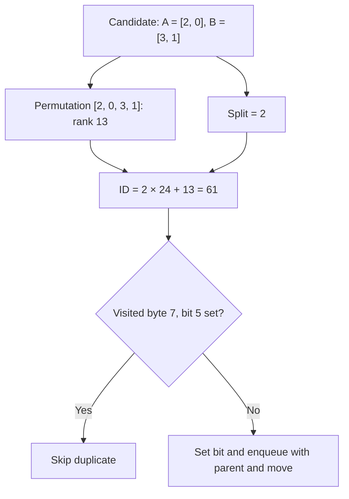
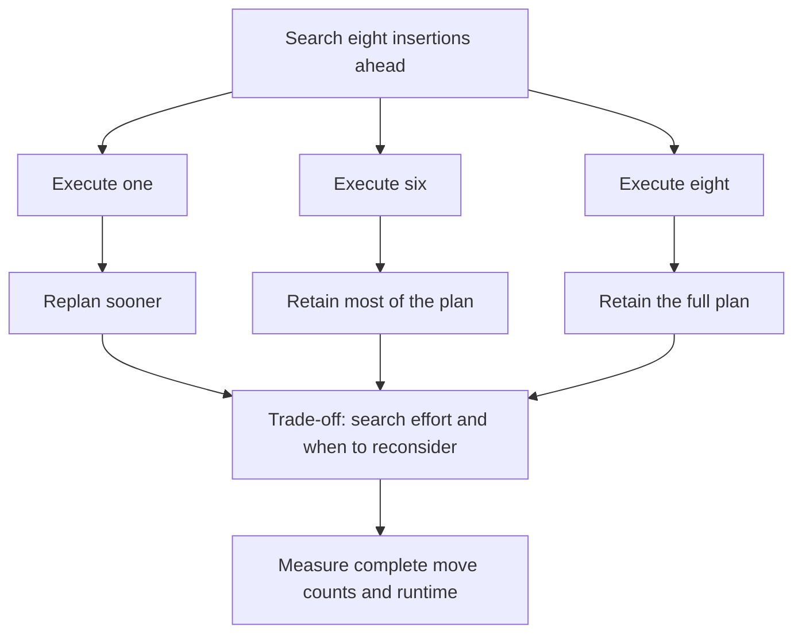

*This project has been created as part of the 42 curriculum by hnah.*

<a id="top"></a>

# push_swap — studying sorting through stack operations and shortest paths


<a id="preface"></a>

## Preface — why I spent so much time on push_swap

I spent a substantial part of my time at 42 reading **Introduction to Algorithms,
Third Edition**, by Thomas H. Cormen, Charles E. Leiserson, Ronald L. Rivest and
Clifford Stein (CLRS). It was a great help throughout this project and an
important companion to my study of algorithms.
[Book reference: MIT Press, 2009](https://mitpress.mit.edu/9780262033848/introduction-to-algorithms/).

Some peers described push_swap as one of the simplest projects in their
curriculum. For me, its small problem statement opened up a much larger set of
questions. I enjoy problems where a few precise rules leave room for many
different solutions. I wanted to build a strong algorithm, but also to learn
as much as I could about why an approach works, where it fails, and how to
improve it within real computational limits. That is why this README is long:
it is both project documentation and a record of an extended investigation.

The roughly four months associated with this project included an absence from
school of more than a month for health and personal reasons. Much of that
period was spent reading, watching algorithm explanations and working through
ideas away from school, with limited access to coding tools. The implementation
work was concentrated into a shorter period. This timeline reflects both my
circumstances and the breadth of the learning process, rather than four months
of continuous coding.

What interested me was the difference between sorting an ordinary array and
minimising instructions under push_swap's restricted operations. Rotating a
stack changes its orientation; reaching and moving an element has a cost in
the permitted instruction set. This does not invalidate ordinary sorting
theory, but it changes the cost model and the strategies worth considering.
The move-minimisation task can be viewed as **combinatorial optimisation**, or
as finding a shortest path through a graph of stack configurations.

In discussions with AI, I explored questions about search, lower bounds and
even NP-completeness. These were questions to investigate, not complexity
classifications I established. I had not found a standard treatment of this
exact eleven-operation problem comparable to the textbook treatment of familiar
sorting algorithms. That sense of unfamiliar territory encouraged me to
experiment. It is not a claim that no relevant papers exist, that the problem
forms a new branch of computer science, or that related stack-sorting and
permutation problems are unstudied.

An early starting point was
[Jamie Dawson's *Push_Swap: The least amount of moves with two stacks*](https://medium.com/@jamierobertdawson/push-swap-the-least-amount-of-moves-with-two-stacks-d1e76a71789a),
which helped me understand hard-coded small cases. For five elements, the
article describes moving the top two to B, sorting the remaining three, and
reinserting the two. The related article
[Ulysse Gerkens's *Push Swap in less than 4200 operations*](https://medium.com/@ulysse.gks/push-swap-in-less-than-4200-operations-c292f034f6c0)
links readers to Dawson for these fundamentals; they are by different authors.

I initially read the five-element construction as an optimal solution.
Discussion with AI helped me distinguish an optimal three-element subroutine
from an optimal complete five-element route: choosing which elements to push
and how to return them also matters. Sorting three takes zero moves when
already sorted and at most two otherwise, but that fact alone proves no
five-element optimum. This was a question raised by my reading, not an
optimality theorem claimed or proved by the article.

My original plan was to compare that five-element strategy against exhaustive
BFS across all 120 permutations, then use the exact answers to develop a
stronger hard-coded five-element solver. That ambition helped lead me to BFS
and the wider optimality questions below. It is not a claim that I completed
that specific comparative study: the current precomputed table covers 1–4
elements, while five elements use runtime BFS.

The question that connected these explorations was simple:

> Given an initial stack A and an empty B, does a sequence of at most K permitted
> operations exist that leaves A ascending and B empty, counting each of the
> eleven instructions as one operation?

This is the **decision version** of finding a shortest solution. It captures a
question I had already been asking; AI helped put it into this explicit form.
It also identifies the exact problem for which I wanted to find a formal
treatment, rather than just another practical sorting strategy. Our limited
search did not identify an academic paper matching these precise rules and
objective; that does not establish that none exists or that the formulation
is original.

A shortest solution does exist for every valid finite input: for example,
repeatedly rotate the smallest remaining element of A to the top and push it
to B, then push everything back to A. This gives a finite legal solution, and
the nonempty set of attainable instruction counts has a minimum. The harder
question is **how to find that minimum, or decide whether it is at most K,
within an affordable amount of time and memory**.

Wanting an optimal answer led me to breadth-first search. Its shortest-path
guarantee under unit operation costs then led directly to the practical problem
of state-space growth, and from there to heuristics, lookahead and pruning.
Those experiments taught me to separate an exact answer, a safe bound and a
useful estimate. A valid solution within K operations answers yes; failing to
find one with a heuristic does not establish no.

This is the thread running through the investigation below. I would find a
careful study of this exact optimisation problem interesting, but this README
is a student's record of pursuing the question, not a claim to a new research
result or a settled complexity classification.

My aim is to connect practical performance with careful reasoning: measure
complete solutions, understand time and memory costs, and establish guarantees
where the assumptions permit them. Exact small-state search and safe pruning
offer particular guarantees; a promising heuristic or a good benchmark result
answers a different question. Throughout this README, I try to distinguish
those forms of evidence rather than imply that every mathematical expression
proves an improvement.

This reflects my broader interest in low-level programming, interfaces,
high-performance systems and systems where correctness matters. Areas I would
like to explore include security-critical software, low-latency market-data
processing, and digital signal-processing pipelines close to hardware.
Push_swap is a learning exercise rather than evidence of readiness for those
domains, but it gives me a concrete setting in which to practise making costs,
invariants and trade-offs explicit.

The result is not a claim to the best push_swap implementation. It is a record
of what I built, tested, reconsidered and still want to understand. Readers
looking for the current implementation can begin with [At a glance](#at-a-glance);
readers interested in the investigation can use the [Contents](#contents) and
the [guide to mathematical claims and evidence](#reading-the-mathematics).

> Implementation snapshot (1 October 2026): small inputs use precomputed answers (1–4) or full-input BFS (5–10); five greedy candidates are also enabled. Archived chunk and seed experiments live in `backups/`. See [Seed candidate flow](#seed-candidate-flow) for current dispatch and settings. Dated experiments below retain their original configurations.

> Update (2026-09-29): fixed the bundled formatter's shared `va_list` handling, which caused the decoded-move debug printer to crash on Apple Silicon. The best-solution scan now considers only generated solutions (`0` through `x->cur`). See the [library portability update](libft/1_ft_printf/README.md#post-submission-update-portable-variadic-argument-consumption) for details and validation. Three generated runs each at 2, 11, 100, and 500 values completed without a crash; sorting correctness and move-count compliance are separate checks.


<a id="at-a-glance"></a>

## At a glance

✅ = implemented. 🚧 = partial or experimental. ❌ = not met or not implemented.
These describe the current code and study tools; they are not evaluation scores.

**Submission readiness is not established by this README.** The active solver
combines exact small-input answers with greedy candidate comparison. Saved
experiments include promising move counts, but they are not a final evaluation
of the current executable. See [current limitations](#current-limitations) for
remaining checks; the old chunk solver's results do not describe current performance.

| Status | Feature | Current behavior |
|---|---|---|
| 🚧 | Integer input | Parses separate arguments and space-separated strings; includes sign, range, duplicate and 500-value checks. Edge cases still need correction and validation. |
| ✅ | Rank normalisation | Replaces each distinct value with its position in sorted order. |
| ✅ | Circular-buffer stacks | Stores A and B in fixed arrays with wrapping read/write indices. |
| ✅ | Operation implementations | Swap, push, rotate, reverse rotate and combined-operation functions are present, alongside BFS state transformations. |
| ✅ | BFS state indexing | Uses a Lehmer permutation rank plus the A/B split and a visited bitset. |
| 🚧 | Archived chunk solver | Rank-interval extraction and restricted BFS replay are preserved in `backups/`; they are not in the active build. |
| ✅ | Candidate comparison | Five greedy strategies are enabled; inputs of at most 10 also receive an exact candidate. The first shortest generated solution is printed. |
| ✅ | Study tools | Includes a permutation analyser, a reverse-BFS shortest-path analyser and an input generator. |
| ✅ | Saved study data | Reports and trial logs are preserved in Git under [`debug/results/`](debug/results/). |
| ✅ | Build organisation | Bundled libft, separate source/header directories, ignored build products and incremental builds. |
| 🚧 | Subject move requirements | Final current-version 100/500-number validation remains outstanding; historical experiments are labelled below. |
| ✅ | Clean instruction-only output | The active candidate solver prints the selected moves to stdout; debug diagnostics use stderr and descriptor 3. |
| ❌ | Bonus checker implementation | The supplied Linux checker is a reference binary, not a checker written for this project. |

[↑ Back to top](#top)

<a id="design-choices-and-edge-cases"></a>

## Design choices and edge cases

| Status | Choice | Why it matters |
|---|---|---|
| ✅ | [Normalise before searching](#rank-normalisation) | Relative order determines sorting; original integer magnitudes need not appear in BFS states. |
| ✅ | [Circular buffers](#circular-buffer-stacks) | Stack operations reuse fixed storage without allocating nodes for each move. |
| ✅ | [Encode states directly](#bfs-and-state-indexing) | A permutation and split identify both stacks, allowing direct visited-bit lookup. |
| 🚧 | [Protect the hidden part of A](#chunk-extraction-and-the-hidden-stack) | Restricts the active search so a chunk can be considered separately from the rest of the stack. |
| 🚧 | [Compare extraction routes](#chunk-extraction-and-the-hidden-stack) | Tries both initial rotation directions and at most one direction change; this is not a global optimality proof. |
| ✅ | [Reverse BFS for study](#analysis-tools-and-study-data) | Reuses distances from the goal to enumerate shortest solutions for small permutations. |
| 🚧 | [Submission edge cases](#current-limitations) | Parser safety, solution-buffer limits and compliance need review; stdout already contains only instructions. |

[↑ Back to top](#top)

<a id="contents"></a>

## Contents

- [Preface](#preface)
- [At a glance](#at-a-glance)
- [Design choices and edge cases](#design-choices-and-edge-cases)
- [How to read the mathematics and evidence](#reading-the-mathematics)
- [Description](#description)
- [Instructions](#instructions)
- [Rank normalisation](#rank-normalisation)
- [Radix: considered, not implemented](#why-radix)
- [LIS, LDS and the square-root guarantee](#lis-lds-guarantee)
- [Circular-buffer stacks](#circular-buffer-stacks)
- [Greedy lookahead: who owns each plan?](#greedy-lookahead-who-owns-each-plan)
- [Greedy heuristics and disorder measures](#greedy-heuristics)
- [Safe pruning bounds](#safe-pruning-bounds)
- [BFS and state indexing](#bfs-and-state-indexing)
- [Precomputed BFS tables, pages, heap and stack](#precomputed-bfs-tables)
- [Chunk extraction and the hidden stack](#chunk-extraction-and-the-hidden-stack)
- [Analysis tools and study data](#analysis-tools-and-study-data)
- [Checks and current limitations](#checks-and-current-limitations)
- [Resources and use of AI](#resources)
- [Future research — ideas not implemented](#future-research)

[↑ Back to top](#top)

<a id="reading-the-mathematics"></a>

## How to read the mathematics and evidence

Mathematical notation in this README serves several different purposes.
**An equation is not automatically an optimality proof or a performance bound.**
In particular, the lookahead/batching equations formalise the recursive
algorithms and my design rationale; they do not establish that eight-lookahead/
six-executed beats execute-one or full batching.

| Label | What the reader can conclude | What the reader cannot conclude |
| --- | --- | --- |
| **Definition / specification** | This states a score, metric or algorithm precisely | That the specified score predicts complete sorting cost well |
| **Structural identity / count** | The relationship follows from the stated mechanism and assumptions | That a larger or smaller value necessarily improves performance |
| **Conditional guarantee / bound** | A conclusion holds under the stated assumptions and for the stated objective | That it extends to a different objective, horizon or algorithm |
| **Empirical observation** | The reported inputs and settings produced the recorded result | That it generalises to other workloads |
| **Design rationale / hypothesis** | This is a reason to explore a choice or a possible explanation to test | That its benefit or causal explanation has been demonstrated |

For example, d-e counts the planned insertions left uncommitted; it is not a
bound on sorting error or wasted moves. By contrast, the one-push-per-element
lower bound genuinely supports safe pruning when compared against a budget
for the same objective. The conditional optimal-suffix argument is a valid
property of exact finite-horizon optimisation, but it does not rank policies
that repeatedly search different, moving horizons.

These are explanatory formulations of existing mechanisms and standard
principles, developed in discussion with AI. The lookahead/batching notation
is not presented as a newly discovered theorem or as proof of a superior
algorithm. Formalising a choice after experimentation can clarify what it
does and what must be tested; it does not retroactively prove why a trial won.

**Why pursue a choice without a guarantee?** A plausible mechanism, an
affordable computation budget and promising observations justify an experiment.
Here, partial commitment preserves part of a jointly evaluated plan while
allowing later reconsideration. That trade-off motivates testing it; correctness
comes from valid stack operations and checking the result, while any claim of
better move counts needs comparative evidence. The rationale is worth testing
even if no setting can be shown to win universally.

<a id="description"></a>

## Description

Push_swap explores sorting with two stacks and a limited vocabulary of moves.
The intended result is an ascending stack A, an empty stack B, and a short list
of instructions that reproduces the sort.

This version is also a study of the search space: how to represent a state,
recognise a state already visited, recover a path, and use small optimal solutions
to investigate larger sorting strategies. The saved reports are reference material
for that investigation, including cases with several equally short solutions.

The main program dispatches inputs of 1–4 values to a precomputed exact table
and 5–10 values to full-input BFS. With the current skip flag set to zero, it
also runs the five greedy candidates; larger inputs use those greedy candidates
alone. The first shortest generated solution wins. Archived chunk experiments
and dated benchmarks are distinguished from this active path below.

[↑ Back to top](#top)

<a id="instructions"></a>

## Instructions

Run these commands from the project directory. Building requires `make`, a C
compiler available as `cc`, and `ar`. The Makefile builds the bundled `libft/`
automatically; no sibling checkout or extra library copy is needed.

### Build and clean

```sh
make                      # ./push_swap
make debug                # bin/push_swap_debug
make analyse_bfs          # bin/bfs_analyser
make analyse_bfs_all_paths # bin/bfs_all_paths
make generator            # bin/generator
make clean
make fclean
make re
```

`make debug` defines `BFS_DEBUG` and links the logging helper. The logging call
in the old BFS implementation is currently commented out, so this target does
not guarantee a separate report. The ordinary executable's progress diagnostics follow `DEBUG` and use stderr;
the solution dump uses file descriptor 3.

`make clean` removes project and libft objects. `make fclean` also removes built
executables and the library archive. Both preserve study reports and the supplied
checker. The current main link rule may relink through the forced libft prerequisite;
the historical timestamp checks below are not a current incremental-build guarantee.

### Run the development solver

```sh
./push_swap 3 2 1
./push_swap "3 2 1"
./bin/generator 5
```

Start with small inputs. BFS allocation now scales with the input's state count,
but factorial growth still makes the upper end expensive. Greedy lookahead can
also be expensive on large inputs. Stdout contains the selected instructions;
stderr carries progress, and descriptor 3 can capture the solution dump:

```sh
./push_swap 3 2 1 > moves.txt 2> progress.log 3> solutions.log
./tests/checker_linux 3 2 1 < moves.txt
```

The supplied checker is a Linux executable. These commands illustrate validation,
not a claim that every input or submission requirement has passed.

### Project layout

| Path | Purpose |
|---|---|
| [`src/`](src/) | Solver, parsing, stack operations and BFS implementation. |
| [`includes/push_swap.h`](includes/push_swap.h) | Shared structures, limits and function declarations. |
| [`libft/`](libft/) | Self-contained library sources used by this project. |
| [`debug/`](debug/) | Analysis and generator sources. |
| [`debug/results/`](debug/results/) | Study reports and trial logs, kept in Git. |
| [`tests/checker_linux`](tests/checker_linux) | Supplied Linux checker binary. |
| [`notes.md`](notes.md) | Working questions, ideas and unfinished plans. |
| `obj/`, `bin/`, `push_swap` | Generated build products, ignored by Git. |

The old `DO_NOT_SUBMIT_DEBUG_hidden_bfs.c` now lives in `backups/` and is not
a dependency of the main build.

[↑ Back to top](#top)

<a id="rank-normalisation"></a>

## Rank normalisation

[`rank_values.c`](src/rank_values.c) counts how many input values are smaller
than each value. For distinct inputs, that gives ranks from `0` to `n - 1`:

```text
values:  40  -8  12
ranks:    2   0   1
```

The ordering is preserved, so the same stack moves sort either representation.
The current implementation compares every value with every other value, taking
O(n²) time. Small BFS states store normalised ranks as unsigned bytes; the main
stacks still store integers.

[↑ Back to top](#top)

<a id="why-radix"></a>

## Radix: considered, not implemented

I considered binary radix as a straightforward baseline, but did not implement
it. After discussing the trade-off with AI, I chose to pursue exact small-state
search and greedy move-cost strategies instead: my interest was in reducing
emitted moves and exploring the search problem, beyond obtaining an easy
baseline. This was a project-specific choice, not a claim that radix is a bad
sorting algorithm. The explanation below records what I learnt while considering it.

What confused me was: why radix? Why can't I just use insertion sort, merge
sort, or another divide-and-conquer algo?

Actually, I can. With a normal array, though, I can access whatever position I
want. In `push_swap`, even if I know exactly where a number belongs, I still
have to get it there using pushes, swaps and rotations. That movement is what
costs me. Spending more time thinking about a move can be worth it if I end up
printing fewer operations.

Insertion sort can translate into rotating to the right position and pushing
a number in. Merge sort is possible too. I initially wondered whether reverse
rotation or access to the end of the array breaks it, but that's not really the
issue: managing the sorted runs and reaching the next element of each run takes
more work with stacks. Partitioning around a pivot is possible as well; I just
have to manage those partitions through the allowed operations.

Radix happens to fit these operations quite naturally. First, **ranks let me
ignore how big the actual numbers are**:

```text
Values:  -40   900   7   120
Ranks:     0     3   1     2
```

I'm basically saying: "I don't care that this number is 900. I care that it's
the biggest of these four."

Sorting the ranks gives the same order as sorting the original values. But now,
instead of dealing with negatives and potentially huge numbers, I've got a tidy
range from `0` to `n - 1`. That keeps the number of binary digits I need to
process small.

Then radix goes through those ranks **one bit at a time**, starting from the
rightmost bit. Each pass splits them into two groups: current bit is `0`, or
current bit is `1`.

So my "two classes" aren't really small indices versus large indices. The groups
change depending on which bit I'm looking at. On the first pass, for example,
I'm separating evens from odds.

That's where the two stacks come in handy: I can push one group to B and rotate
the other group within A. Then I bring B back. Done properly, each group keeps
its relative order, so the next bit's pass builds on the previous pass instead
of undoing it. Pushing a group to B reverses its order, and pushing it all back
reverses it again.

So ranks make the numbers convenient to work with, and radix gives me a
repetitive process that fits the stack operations. It's a good basic algo
because it's straightforward and predictable, with O(n log n) stack operations
for the usual binary passes. That doesn't mean it gives the fewest moves.
That made it an understandable baseline to consider, but it was not the
implementation direction I ultimately took.

[↑ Back to top](#top)

<a id="lis-lds-guarantee"></a>

## LIS, LDS and the square-root guarantee

A subsequence can skip intervening numbers, but keeps their original relative
order. So in `1 8 2 9 3 4`, I can keep `1 2 3 4` as an increasing subsequence.
LIS means longest increasing subsequence; LDS means longest decreasing subsequence.

The **Erdős–Szekeres theorem** says that, for positive integers $r$ and $s$, any
sequence of distinct numbers with length

```math
n \geq (r - 1)(s - 1) + 1
```

contains an increasing subsequence of length at least $r$, **or** a decreasing
subsequence of length at least $s$.
See [the theorem statement in this research paper](https://www.sciencedirect.com/science/article/am/pii/S0195669821001505).

Taking equal thresholds gives the square-root guarantee:

```math
\max\bigl(\mathrm{LIS}(A),\mathrm{LDS}(A)\bigr)
\geq \left\lceil\sqrt{n}\right\rceil.
```

For my 500-number input:

```math
\begin{gathered}
(23 - 1)^2 + 1 = 485 \leq 500 \\
\left\lceil\sqrt{500}\right\rceil = 23. 
\end{gathered}
```

So yes, there must be an LIS **or** LDS of at least 23 elements. The catch is
that I don't get to choose which one the theorem guarantees. A completely
descending input has

```math
\begin{gathered}
\mathrm{LIS}(A) = 1 \\
\mathrm{LDS}(A) = 500. 
\end{gathered}
```

My implemented circular-LIS preparation keeps an increasing subsequence in A
and pushes the rest to B before greedy reinsertion. This theorem alone doesn't
guarantee that I can keep 23 elements in A: the long subsequence might be
decreasing. It also doesn't promise a particular push_swap move count.

### What LIS length should I expect from random inputs?

For a uniformly random permutation of $n$ distinct ranks, the expected ordinary
LIS length $L_n$ has the asymptotic estimate

```math
\mathbb{E}[L_n] \sim 2\sqrt{n}
\qquad (n \to \infty).
```

| Input size | Leading-order estimate $2\sqrt{n}$ |
| --- | ---: |
| 100 | 20 |
| 500 | 44.7 |

So this gives me a baseline for random testing, not a minimum seed size or an
exact average at 100 or 500 elements. A reverse-sorted input still has ordinary
LIS length 1. See this [research paper discussing the expected-length result](https://math-faculty.net.technion.ac.il/files/2021/05/Law-of-large-numbers-for-increasing-subsequences-of-random-permutations.pdf).

My circular LIS searches all rotations, so its length is at least the ordinary
LIS length for the same input. It may keep more elements, but this formula is
for ordinary LIS; I should measure circular seed lengths rather than treat
$2\sqrt{n}$ as their expected value. Neither estimate guarantees the final move
count, since rotations and reinsertion choices still matter.

### Why keep the longest seed?

What makes a useful seed for my reinsertion algo? Once I've pushed the other
elements to B, the elements kept in A must be circularly ascending. An increasing
subsequence gives me that property. It doesn't need consecutive ranks or a `0`
at the start: greedy reinsertion can fill the gaps later.

Suppose I start with $n$ elements in A and empty B, and keep a seed $S$ of
length $k$. If I push each remaining element to B exactly once, then return
each to A exactly once, the push count is

```math
P(S) = \underbrace{(n-k)}_{\mathrm{pb}}
     + \underbrace{(n-k)}_{\mathrm{pa}}
     = 2(n-k).
```

So every extra element I keep saves exactly two pushes under this strategy:

```math
P(k+1)-P(k)=-2.
```

That's my mathematical reason for starting with LIS: among ordinary increasing
subsequence seeds, choosing the longest one minimises this push count. It is
not a lower bound for every possible push_swap algorithm; other strategies
can use swaps or different transfers.

**Preliminary saving prediction versus a 3-element seed.** Before measuring
results, I can predict the push component. Assuming each non-seed element is
pushed out and back exactly once, keeping $k$ elements instead of 3 saves

```math
\Delta P = 2(n-3)-2(n-k)=2(k-3).
```

Using the ordinary random-LIS estimate $\mathbb{E}[L_n]\sim2\sqrt{n}$ gives a
rough leading-order prediction:

```math
\mathbb{E}[\Delta P] \approx 4\sqrt{n}-6.
```

| Input size | Estimated ordinary LIS length | Predicted pushes saved versus keeping 3 |
| --- | ---: | ---: |
| 100 | 20 | 34 |
| 500 | 44.7 | 83.4 (about 84 if the seed has 45 elements) |

These are preliminary estimates for uniformly random permutations, not test
results or a prediction of the complete solution's move count. Circular LIS may
retain more elements; once I measure its actual length $k$, $2(k-3)$ gives the
exact push difference under the assumptions above. Preparation, rotations and
swaps can increase or decrease the total saving. Measured seed comparisons appear in the dated discussion below; these push-only
estimates do not assume that other costs stay unchanged.

For example, both seeds below have length 9 and require just two pushes:

```text
Input: 0 1 2 8 4 9 10 11 12 13
Keep:  0 1 2 8   9 10 11 12 13   -> move 4 out and back
Keep:  0 1 2   4 9 10 11 12 13   -> move 8 out and back
```

The catch is rotations. If $R(S)$ counts the rotation instructions for
extraction, reinsertion and final alignment (with `rr` or `rrr` counting as one
instruction), this push-and-rotate strategy has total cost

```math
M(S)=2(n-|S|)+R(S).
```

A longer seed reduces the first term, but can change the second. So LIS is a
justified starting heuristic, not proof of the fewest total moves. The current implementation keeps the first longest seed it finds; comparing
rotation costs between equally long seeds remains a possible extension. Circular seed selection can also retain more than an
ordinary LIS: `8 9 0 1 2` is already circularly ascending as a whole.

[↑ Back to top](#top)

<a id="circular-buffer-stacks"></a>

## Circular-buffer stacks

Each stack has an integer array, a capacity, a read index and a write index.
The indices wrap around the array. One spare slot distinguishes a full buffer
from an empty one, so `n` input values use a capacity of `n + 1`.

The circular-buffer helpers implement the underlying movements. The
`stack_operation_*.c` wrappers also append an encoded move to the solution.
The output helper translates those codes back to names such as `sa`, `pb` and
`rra`, one instruction per line. Progress diagnostics use stderr; the detailed
solution dump uses descriptor 3. Neither is part of stdout's instruction stream.

[↑ Back to top](#top)

<a id="bfs-and-state-indexing"></a>

## BFS and state indexing

### Lehmer ranking: give every state an exact address

**Lehmer ranking replaces searching through previously discovered states with
calculating a unique integer ID and checking one bit.** It identifies a
permutation exactly; it does not estimate its distance from sorted order.

The implementation is
[bfs_optimiser_lehmer_rank.c](src/sorting_algorithms/Brute_force/BFS/bfs_optimiser_lehmer_rank.c).
A state stores A followed by B, both top to bottom, with a split recording the
number of elements in A. The BFS representation uses distinct small local ranks
$0,\ldots,n-1$.

| Component | Example |
| --- | --- |
| A, top first | 2, 0 |
| B, top first | 3, 1 |
| Combined permutation $p$ | $(2,0,3,1)$ |
| Split (number of elements in A) | 2 |

### Why factorials appear

There are $n!$ permutations of $n$ distinct values. In lexicographic order, each
possible first value heads a block of $(n-1)!$ permutations. After fixing it,
each possible second value heads a block of $(n-2)!$, and so on.

Factorials are **block sizes used to calculate an address**. The calculation
does not generate every permutation.

For each position $i$, count the smaller values to its right:

```math
\begin{gathered}
c_{i}=\#\lbrace j:i\lt j\lt n,\ p_{j}\lt p_{i}\rbrace \\
0\le c_{i}\le n-1-i. 
\end{gathered}
```

Here, `#` means the number of elements in the set (its cardinality).

These digits form the **Lehmer code**. Their factorial-weighted sum gives the
zero-based permutation rank:

```math
\begin{gathered}
R(p)=\sum_{i=0}^{n-1}c_{i}(n-1-i)! \\
0\le R(p)\lt n!. 
\end{gathered}
```

This is a mixed-radix representation: unlike decimal digits, the allowed digit
range shrinks at each position. Remember $0!=1$; the last digit is always zero.

For $p=(2,0,3,1)$:

| Position | Value | Smaller values to the right | Digit | Weight | Contribution |
| ---: | ---: | --- | ---: | ---: | ---: |
| 0 | 2 | 0, 1 | 2 | $3!=6$ | 12 |
| 1 | 0 | None | 0 | $2!=2$ | 0 |
| 2 | 3 | 1 | 1 | $1!=1$ | 1 |
| 3 | 1 | None | 0 | $0!=1$ | 0 |

```math
\begin{aligned}
R(2,0,3,1)&=2\cdot3!+0\cdot2! \\
&\quad+1\cdot1!+0\cdot0! \\
&=13.
\end{aligned}
```

There are 12 permutations beginning with 0 or 1, plus one earlier permutation
within the chosen prefix: $(2,0,1,3)$. Thus $(2,0,3,1)$ has rank 13.

### Why permutations cannot collide

The factorial blocks do not overlap. To recover the permutation from its code,
start with the sorted unused values, select the value at zero-based index $c_i$,
and remove it:

| Digit | Unused values before selection | Selected value |
| ---: | --- | ---: |
| 2 | 0, 1, 2, 3 | 2 |
| 0 | 0, 1, 3 | 0 |
| 1 | 1, 3 | 3 |
| 0 | 1 | 1 |

This uniquely recovers $(2,0,3,1)$. Ranking is reversible and collision-free for
valid permutations. It is not a hash with possible collisions. The implementation
only needs the ranking direction, not decoding.

### Include the stack split

The same permutation with a different split represents different stacks.
Reserve a block of $n!$ IDs for each split:

```math
\begin{gathered}
\mathrm{ID}(p,s)=s\,n!+R(p) \\
s\in\{0,\ldots,n\}. 
\end{gathered}
```

For our example:

```math
\begin{gathered}
n=4,\quad s=2,\quad R=13 \\
\mathrm{ID}=2\cdot24+13=\boxed{61}. 
\end{gathered}
```

| Split | Meaning | ID range for $n=4$ |
| ---: | --- | --- |
| 0 | A empty | 0–23 |
| 1 | One element in A | 24–47 |
| 2 | Two elements in A | 48–71 |
| 3 | Three elements in A | 72–95 |
| 4 | B empty | 96–119 |

There are $n+1$ possible splits, so the number of encodable states is:

```math
\begin{gathered}
N=(n+1)n!=(n+1)! \\
0\le\mathrm{ID}\lt N. 
\end{gathered}
```

Equivalently, choose which $s$ elements go into A, then order both stacks:

```math
\begin{aligned}
N&=\sum_{s=0}^{n}\binom{n}{s}s!(n-s)! \\
 &=\sum_{s=0}^{n}n! \\
 &=(n+1)!.
\end{aligned}
```

This counts all encodable states; BFS stops when it finds the goal and need not
visit them all.

### From an ID to a visited bit

The BFS stores one visited bit per ID:

```math
\begin{gathered}
\text{byte index}=\left\lfloor\frac{\mathrm{ID}}8\right\rfloor \\
\text{bit offset}=\mathrm{ID}\bmod8. 
\end{gathered}
```

For ID 61, that is byte 7, bit 5 (both zero-based).

> **AI-generated diagram:** The Mermaid diagram below was generated by ChatGPT/Codex; I did not draw or write the diagram myself. I worked through this project's algorithm design and process together with AI in earlier discussions. The diagram documents that implementation; it does not imply that I invented Lehmer ranking. See [Use of AI](#use-of-ai) for the scope of AI assistance, including debugging and diagnostic printing tools.



The bit operations used in the BFS are:

```c
/* Check whether this state was already discovered. */
visited[state_id / 8] & (1 << (state_id % 8))

/* Mark it as discovered. */
visited[state_id / 8] |= (1 << (state_id % 8));
```

With unit-cost moves, BFS first discovers a state at minimum depth within its
explored graph. Later routes to the identical state need not enqueue it again:
the available continuations depend on that state, not the route taken to it.
Each discovered node records its parent and incoming move so the final path
can be reconstructed backwards.

### What the optimization saves

The old duplicate check scanned previously discovered nodes and compared their
arrays. With $V$ stored states and $n$ values, this takes up to $O(Vn)$ work per
candidate. The current nested-loop ranking performs exactly

```math
\frac{n(n-1)}2
```

value comparisons, then one bit lookup.

| Method | Worst-case duplicate-check work per candidate |
| --- | --- |
| Scan previously discovered states | $O(Vn)$ |
| Current Lehmer ranking plus visited bit | $O(n^2)+O(1)$ |

For $n=10$, ranking makes 45 value comparisons regardless of whether BFS has
discovered 100 states or one million. Only the bit lookup is $O(1)$; the complete
rank-and-check operation is $O(n^2)$.

The implementation precomputes factorials in its lookup table. It does not
enumerate $n!$ permutations to compute a rank. The speedup comes from eliminating
the growing scan of stored states. This is separate from greedy branch-and-bound
pruning, which skips branches based on cost.

### Limits: indexing does not remove factorial growth

The visited bitset requires

```math
\left\lceil\frac{(n+1)!}{8}\right\rceil
```

bytes. With the configured maximum of 10 elements, $11!=39,916,800$ states need
4,989,600 bytes (about 4.76 MiB) for visited bits alone. The node array containing
states, parents and moves needs additional, much larger storage. The current
BFS sizes its node array and visited table using `bfs_possible_states(n)` for
the current input, rather than allocating the ten-element maximum on every call. Increasing
the limit also requires checking integer ranges and representation limits.

**Current full-input BFS:** `solve()` checks that B is empty at entry and that
count matches A. For 5–10 values it invokes BFS over all eleven operations,
without the archived hidden-stack restrictions. For 1–4 it uses the precomputed
table. Both produce shortest answers under unit instruction costs; the first
goal reached by FIFO BFS supplies the runtime path.

The BFS helper itself still relies on its caller's empty-B and normalised-rank
contract. A ten-element A above nonempty B in a larger problem is not a supported
entry. The old restricted chunk/seed experiments in `backups/` are separate
from this active full-input implementation.

[↑ Back to top](#top)

<a id="precomputed-bfs-tables"></a>

## Precomputed BFS tables, pages, heap and stack

Study idea, now demonstrated by the n=1..4 sample below: generate shortest
solutions offline with reverse BFS, then use Lehmer ranks to look them up at runtime.
The runtime solver would no longer need the BFS queue and visited table, but
generating the data still needs search time and memory.

### Three ways to store the answers

Let `n` be the number of values, `m` the solution length, and `L` the average
stored solution length. My current nested-loop Lehmer ranking takes O(n²).
The times below cover table indexing and traversal, excluding input parsing,
initial value normalisation, executing stack operations and printing output.

| Technique | Runtime traversal | Approximate table storage for fixed n |
| --- | --- | --- |
| Full packed solution per initial permutation | Rank once, locate the sequence, read m moves: O(n² + m) | n! × L / 2 bytes, plus offsets/lengths or padding |
| Next move only per state | Read a move, apply it, recompute the state ID: O(m × n²) | (n + 1)! / 2 bytes |
| Next move plus next-state ID | Rank once, follow stored indices: O(n² + m) | 4.5 × (n + 1)! bytes with 32-bit IDs and separately packed moves |

The full-solution table only needs the `n!` initial permutations with B empty.
The other two dense tables cover all A/B splits: `(n + 1) × n!` states. After
`pb`, a table covering only initial states would no longer be enough. Reverse
BFS must store a move towards the goal, reducing the remaining distance by one;
reaching the goal ends traversal.

Index hopping is O(1) per move, but recomputing my Lehmer rank is not. Full
solutions can also have better cache locality because their moves are adjacent.
Saving only the next move trades repeated ranking work for compact storage;
adding next-state IDs can cost more memory than storing complete initial-state
solutions. The 4.5-byte estimate assumes IDs fit in 32 bits and separate arrays;
a C struct may add padding. Packing the move and ID together is another option
when their combined bit widths fit the chosen integer type.

For example, at `n = 8`, **assuming** an average full solution of 20 moves:

| Representation | Approximate size |
| --- | ---: |
| Full solutions | 394 KiB, before offsets/lengths or padding |
| Next move only, all splits | 177 KiB |
| Next move + 32-bit next-state ID, all splits | 1.56 MiB |

That average is illustrative, not a measured BFS result.

### Two moves per byte, no homemade WinRAR needed

There are 11 operations, so four bits are enough for one operation. Assigning
codes `1..11` leaves `0` available as an end marker. With the first move in the
high nibble, moves `1, 2, 3, 4, 5, END` become bytes `0x12, 0x34, 0x50`.
Extract move `i` with `(data[i / 2] >> ((1 - i % 2) * 4)) & 15`.
Terminator codes and per-entry alignment add overhead to full-solution storage;
alternatively store lengths. Packed bytes can contain zero, so `strlen` cannot
measure this data.

Even at half a byte per state, factorial growth catches up quickly:

| n | Next-move-only table, all A/B splits |
| ---: | ---: |
| 8 | 177 KiB |
| 9 | 1.73 MiB |
| 10 | 19.0 MiB |
| 11 | 228 MiB |
| 12 | 2.90 GiB |

These are packed data sizes, not C source sizes or total process memory.

### What I learnt about pages, heap and stack

Calling this table "ROM" was misleading. On a typical Linux build, a
`static const` array can live in the executable's read-only data section
(`.rodata`). That is ordinary memory with write protection, not hardware ROM.
`const` alone does not determine placement: a function-local static table has
static storage duration; a normal automatic local array typically uses the
stack, and a `malloc` allocation uses the heap. The C language does not require
these exact OS-level placements.

| Resource | What a hypothetical 10 GB read-only table means |
| --- | --- |
| Disk | The executable contains roughly that much table data |
| Virtual address space | The loader maps an address range for the table |
| Physical RAM | Accessed pages become resident on demand; the entire table need not be resident |
| Stack / heap | No separate full-table copy is needed unless the program explicitly makes one |

If a mapped page is not resident, accessing it causes a page fault. Linux can
bring it in from the executable, or use an already cached copy, then resume the
program. Pages are commonly 4 KiB, though this depends on the system. Linux may
also read ahead. Under memory pressure, unchanged file-backed pages can be
discarded and reloaded from the executable instead of being written to swap.

For a **full-solution** lookup, one short sequence might fit in one page. That
does not mean the whole program needs only 4 KiB: the offset lookup may touch
another page, a sequence can cross a boundary, and code, stacks, buffers and
other data also need memory. The **next-move** techniques can touch a different
page after every move. Scattered uncached accesses can make disk latency matter
far more than the few instructions needed to decode a move.

So a 10 GB executable does not automatically need 10 GB of RAM on a 64-bit
system. Practical obstacles include compiler memory/time for huge initializers,
toolchain addressing and object-size limits, virtual address space, disk and
repository limits, and generating the BFS data in the first place. C does not
universally guarantee support for an object that large. A 32-bit process would
not have enough address space to map the entire 10 GB table at once.

### Authorship and AI assistance for precomputed solutions

I (hnah) proposed the precomputed-solution design, the function prototypes and
responsibilities for `encoded_bfs_data`, `decode_bfs_data` and
`get_precomputed_bfs`, the encoding/decoding mechanism, and how the lookup
would integrate with my existing solution storage and solver. I also proposed
compressing two moves into one byte (`unsigned char`), using four bits per
move. These design decisions and the original function template were mine.

AI assistance supplied and ran the offline Python script
[`generate_precomputed_sample.py`](debug/generate_precomputed_sample.py) to
compute the BFS answers and emit the packed table bytes. AI also supplied the
detailed arithmetic for packing and extracting the nibbles with bit shifts and
masks, and recommended hexadecimal notation to make the two move codes visible
in each byte. The script generates the table data; it does not generate the
whole C implementation or originate its design.

I asked why we could not simply store the actual character/byte values from
the 256 possible values of an eight-bit byte. The explanation was about source
readability: the compiled array already stores those actual byte values, while
hexadecimal shows each four-bit move code as one hex digit. This makes the
packed moves easier to inspect alongside my existing move-code decoding table.
Raw characters can be invisible or require escaping; hexadecimal notation does
not itself provide additional compression.

I subsequently requested `0xNN` array entries instead of `\xNN` string
escapes, and first-move-first ordering: the first move occupies the high (left)
nibble and the next move occupies the low (right) nibble. AI implemented that
change across the generator, table and decoder and ran the verification checks.
For example, `0x91` now represents `rra` followed by `sa`.

### Working sample using my solution template

[`precomputed_ranks_bfs.c`](src/sorting_algorithms/Exact_hardcoded/precomputed_ranks_bfs.c)
implements the **full-solution** technique for every permutation of 1–4 values.
It follows my original `encoded_bfs_data` / `decode_bfs_data` /
`get_precomputed_bfs` template. The filename was changed to lowercase for Norm.
These are actual generated shortest answers, not placeholder bytes.

There are `1! + 2! + 3! + 4! = 33` entries, each occupying three bytes.
Reverse BFS found a maximum of five moves for these initial states, leaving a
sixth nibble for the zero terminator. The data occupies exactly 99 bytes in a brace-enclosed `unsigned char` array
using `0xNN` integer constants, with no implicit string terminator. Each byte
stores the first move in its high (left) hex digit and the next move in its low
(right) digit. Embedded zero bytes are intentional; this is
binary data, not a string to pass to `strlen`.

`starts = {0, 0, 1, 3, 9}` locates each input size's first entry. For example,
the 24 four-value permutations start after the first nine entries. The address is:

```c
data + (starts[count] + lehmer_rank) * 3
```

This needs a `const unsigned char *`, not `int **`: the pointer identifies the
first packed byte of one contiguous solution. A single `int` cannot hold an
arbitrarily long solution. `x->ans` remains my existing `char **`, with one
allocated answer buffer per algorithm candidate. Do not replace one of those
owned buffers with a pointer into static data: the representations differ, and
the cleanup code frees those buffers.

The caller uses the existing `new_soln_init` (the initializer I meant by
"new_algo_init"), then calls:

```c
get_precomputed_bfs(x, &stacks[A], count);
```

Its contract is a fresh answer slot, B empty, and distinct normalised ranks
`0..count-1` in A. It records into `x->ans[x->cur]` using
`append_move_to_soln`, which updates both `x->step` and `x->ans_len[x->cur]`.
It does not mutate the stacks. `solve()` now uses it in the existing BFS
candidate slot for 1–4 values; larger inputs retain the previous search path.
No extra candidate allocation is necessary.

The decoder deliberately uses ordinary numbers rather than bit-mask macros:

```c
move = (packed[i / 2] >> ((1 - i % 2) * 4)) & 15;
```

- `i / 2` selects the byte, since each byte contains two moves.
- `i % 2` selects the first or second move.
- `(1 - i % 2) * 4` shifts by four bits for the first move, then zero for the second.
- `15` is binary `1111`, keeping the low four bits after shifting.
- Zero ends the sequence; values `1..11` select my existing move characters
  through `"0123456789AB"`, including `'A'` and `'B'` for `rrb` and `rrr`.

The lookup is O(1) **after** calculating the rank. Calculating the rank is O(n²),
and decoding/storing m moves is O(m), so the complete call is O(n² + m).
Saving m decoded characters into `x` cannot be an O(1) operation.

Reproduce the bytes and run exhaustive sample checks with:

```sh
python3 debug/generate_precomputed_sample.py
python3 tests/test_precomputed_sample.py
norminette src/sorting_algorithms/Exact_hardcoded/precomputed_ranks_bfs.c
```

The Python generator is an offline study tool, not part of the C build. Tests
compare the C bytes against reverse BFS, check all 33 permutations and optimal
lengths using the supplied checker, exercise wrapped circular buffers through
the direct API, and check a five-value input still uses the fallback correctly.

### How much fits in a 500 MB executable budget?

Here I mean **500,000,000 bytes**, not 500 MiB or 500 MB of resident RAM.
Other executable contents also need some space. For full solutions, the exact
answer depends on their lengths and the chosen table layout. The 19 MiB figure
for n=10 above belongs to the next-move-only technique, not this sample's layout.

**n=10 is safely within the data budget. n=11 needs measurements before I can
claim it fits.** A conservative bound gives a concrete reason: repeatedly
rotate the smallest remaining value to A's top, push it to B, then push all
values back. At size k, reaching any position needs at most `floor(k / 2)`
rotations. This constructs a valid solution in at most
`floor(n² / 4) + 2n` moves, so shortest solutions cannot be longer.

| n | Conservative move bound | Bytes per entry, including zero terminator | Fixed-width full table |
| ---: | ---: | ---: | ---: |
| 10 | 45 | 23 | 83,462,400 bytes |
| 11 | 52 | 27 | 1,077,753,600 bytes |
| 12 | 60 | 31 | 14,849,049,600 bytes |

These are upper-bound layouts, not measured shortest-path maxima. Using a
separate width for each size, all tables from n=1 through n=10 together fit
within 91,485,206 data bytes under this same bound. The sample does **not**
generate these larger tables.

For n=11, even spending the whole 500 MB on that size permits only 12 whole
bytes per fixed-width entry: at most 23 moves plus the terminator. We would
need to establish that every shortest answer fits, or measure the total size
of a variable-length layout including its offsets. The conservative bound
alone cannot decide that. For n=12, a fixed-width table permits only one byte
per entry, which plainly cannot encode every answer with this format.

Increasing the sample's limit is not enough: the data must be regenerated,
entry widths and offsets updated, and ranking/index types checked. My current
BFS state and factorial helpers also have explicit size limits. Generating and
compiling a large table may need far more memory than looking up one answer.
Keeping a huge initializer within the Norm is a separate unresolved design
constraint; this small sample fitting the Norm does not establish that a giant
generated version would.

### Submission considerations

The local push_swap subject forbids global variables. A file-scope `static const`
array is still a file-scope object; neither `const` nor putting it in a `.h`
automatically makes it acceptable. A function-local `static const` table avoids
global scope, but its initializer still has to fit the Norm's formatting and
function-length rules. Multiline macros or obfuscation are not a workaround.
Passing norminette alone does not establish compliance with every review rule.
The documents checked did not explicitly ban precomputed solutions or specify
a table-size limit; that is not a guarantee that any generated table is suitable
for submission.

**I won't submit a 10 GB file lah.** This was just how a BFS lookup-table idea
turned into me learning about pages, virtual memory, the heap and the stack.
The evaluator should be checking my sorting, not downloading my homemade WinRAR
replacement.

[↑ Back to top](#top)

<a id="chunk-extraction-and-the-hidden-stack"></a>

## Chunk extraction and the hidden stack

**Experiment outcome:** this chunking approach did not work out for my move-count
goal. In my earlier trials, 500 elements took roughly **10,000–12,000 moves**.
My observation was that most moves went into selecting and extracting elements
in increasing order to form the chunks. Finding short BFS routes for the small
chunks did not make up for that selection cost. These are my reported results
for this implementation, not a claim that every chunking algorithm performs
poorly. I am shelving this approach and focusing on full-input BFS for small
inputs and LIS/greedy strategies for larger ones.

The archived development path processed successive rank intervals of up to ten
values. It first moved the selected interval from A to B, then created temporary
stacks containing the active chunk, searched for a solution and replayed that
solution on the real stacks.

[`chunk_optimal_BFS.c`](backups/chunk_optimal_BFS.c) simulates extraction
routes before executing one. It tries each initial rotation direction and each
point at which to reverse direction after collecting a target value. It chooses
the lowest rotation-plus-push cost among those candidates.

“Optimal” here refers only to that limited family of extraction routes. The code
does not compare arbitrary direction changes or the total future sorting cost.
Likewise, a short BFS solution for one chunk does not prove that the full sequence
meets the subject's move requirements.

The archived hidden search treated the unseen portion of A as a boundary: it
disallowed A rotations when the visible portion was nonempty and disallowed
`sa` when fewer than two visible values were available. This is the experiment behind “hidden BFS”. Its overall
correctness and efficiency still need broader validation.

[↑ Back to top](#top)

<a id="analysis-tools-and-study-data"></a>

## Analysis tools and study data

The two analysis executables accept an `n` from 2 to 7 and write timestamped
reports into their working directory. For a small reverse-BFS study:

```sh
make analyse_bfs_all_paths
mkdir -p debug/results
(cd debug/results && ../../bin/bfs_all_paths 3)
```

The reverse analyser builds distances from the sorted goal, uses all eleven
operations, and enumerates shortest paths by following moves that reduce the
remaining distance. The active full-input BFS now also uses all eleven
operations; unlike the reverse analyser, it searches forward from one input.

The permutation analyser can be run with
`(cd debug/results && ../../bin/bfs_analyser 3)` after `make analyse_bfs`.
Its source calls `brute_solve`; historical reports can reflect earlier search
restrictions. In the current README audit, `analyse_bfs_all_paths` built, but
`analyse_bfs` failed to link because its target omits required debug-printer
symbols. Its command above requires fixing that development target first.

| Saved material | What to study |
|---|---|
| [`debug/results/`](debug/results/) | All preserved BFS reports and 500-number trial logs. |
| [All shortest paths, n = 5](debug/results/push_swap_bfs_all_paths_n5_2026-08-24_22-02-49.txt) | The report records 120 starting permutations, 720 graph states and a maximum optimal distance of 9. |
| [All shortest paths, n = 7](debug/results/push_swap_bfs_all_paths_n7_2026-08-24_22-02-53.txt) | The report records 5,040 starting permutations, 40,320 graph states and a maximum optimal distance of 13. |
| [`notes.md`](notes.md) | Questions about pattern discovery, heuristics and how small solutions might inform larger cases. |

These numbers describe the saved reports, not a fresh evaluation of the current
executable. The reports are important study data and are **not ignored**. Build
cleanup does not delete them. Larger all-path reports can grow quickly because
one starting permutation may have many equally short solutions.

[↑ Back to top](#top)

<a id="checks-and-current-limitations"></a>

## Checks and current limitations

### Build checks

The following are **historical** checks from the directory reorganisation,
not guarantees about the current targets. They establish build behavior at
that time, not sorting correctness or a subject score.

| Result | Check |
|---|---|
| ✅ | Main executable and all four development tools build with `-Wall -Wextra -Werror`. |
| ✅ | Repeating all build targets leaves executable and archive timestamps unchanged. |
| ✅ | `make clean` removes objects while preserving executables. |
| ✅ | `make fclean` removes build products while preserving the checker and all 17 existing study reports. |
| ✅ | All targets rebuild after cleanup. |
| ✅ | Deleted main and analyser executables are recreated. |

The current README audit rebuilt the main executable and reverse all-path
analyser successfully. Four small smoke cases (one value, sorted three,
unsorted three and unsorted five) returned `OK` from the supplied checker.
The forward analyser currently fails to link against required debug printers.
This limited check is not a final benchmark, Norm audit or full validation.

<a id="current-limitations"></a>

### Current limitations

The active solver already separates instructions from diagnostics and has exact
small-input dispatch. Remaining implementation and validation work includes:

- Record reproducible move-count and runtime benchmarks for the current settings.
- Review parser safety: a non-space character after digits can leave the count
  unchanged before an array write; long leading-zero strings hit a digit limit.
- Check the no-argument/over-limit paths and integer-boundary conversion. A valid
  single integer is no longer rejected by the old minimum-count check.
- Review already-sorted inputs: there is no global early exit before all enabled
  candidates run, although an exact candidate or the three-value-seed candidate
  can provide a zero-move answer where applicable.
- Add or verify bounds handling for the fixed `MAX_MOVES_CONSIDERED` answer
  buffers: `append_move_to_soln` currently writes without checking capacity.
- Validate allocation-failure cleanup and memory behaviour; normal solution
  buffers are freed, but this documentation pass is not a leak audit.
- Account for factorial BFS memory at the upper limit and costly lookahead.
- Update development harnesses to match current candidate counts and descriptor-3
  dumps; see the seed-test note below and random-runner metadata limitation.
- Review Norm, allowed functions and global variables before submission. Build
  success and saved successful examples are not a complete compliance check.

[↑ Back to top](#top)

<a id="resources"></a>

## Resources

- Jamie Dawson. [*Push_Swap: The least amount of moves with two stacks*](https://medium.com/@jamierobertdawson/push-swap-the-least-amount-of-moves-with-two-stacks-d1e76a71789a), 11 May 2019. An early foundation for my understanding of hard-coded small cases and the five-element optimality question described in the preface.
- Ulysse Gerkens. [*Push Swap in less than 4200 operations*](https://medium.com/@ulysse.gks/push-swap-in-less-than-4200-operations-c292f034f6c0), 1 August 2023. A related implementation article that links to Dawson's small-case explanation; its reported performance belongs to that author's implementation.

- [aaax8 — push_swap](https://github.com/aaax8/push_swap) and its [Japanese technical report](https://github.com/aaax8/push_swap/blob/main/docs/push_swap_report.qmd). I came across this repository through Slack in September 2026 while working on this project. Its discussion of beam search for initial solutions and Iterated Greedy destruction/reconstruction inspired me to consider alternative candidates, lookahead and pruning. This is an acknowledgement of influence, not a claim that I implemented its beam search or Iterated Greedy methods.

- Thomas H. Cormen, Charles E. Leiserson, Ronald L. Rivest and Clifford Stein. [*Introduction to Algorithms*, third edition](https://mitpress.mit.edu/9780262033848/introduction-to-algorithms/). MIT Press, 2009. ISBN 978-0-262-03384-8. A major reading reference during my time at 42 and a substantial help to this project; see the [preface](#preface).

- [aleksify — pushswap-research](https://github.com/aleksify/pushswap-research) explores move-sequence optimisation and BFS-based superoptimisation. Its **More Thoughts** section proposes bounded lookahead with beam search or Monte Carlo Tree Search and discusses the difficulty of scoring intermediate stack states. Useful inspiration for testing lookahead in greedy reinsertion; those proposed approaches are not benchmark evidence that two-insertion lookahead, circular-LDS preparation, or their combination will improve this solver.
- [A. Yigit Ogun — Push Swap: A journey to find most efficient sorting algorithm](https://medium.com/@ayogun/push-swap-c1f5d2d41e97) introduces the Turk algorithm. Related reference for my greedy reinsertion approach: both choose transfers by move cost, but mine applies that choice when returning elements from B into circularly sorted A.
- [Working notes](notes.md) and [saved study reports](debug/results/) document the investigation and examples.
- [Bundled libft documentation](libft/README.md) describes the shared library.
- [Pipex README](../2_pipex/README.md) provides the structure used here: feature status, design explanations, reproducible commands and explicit limitations.
- Harvard CS50 lectures by David J. Malan, peer discussions and debugging references contributed to the broader learning process recorded in the previous README.

### Use of AI

I use ChatGPT/Codex for explanations, alternative approaches and tradeoffs, and
help when I am stuck. I bring questions, ideas and deductions into the discussion
and work through the reasoning with AI. This project's algorithm design and
process were developed through that collaboration; established methods such as
Lehmer ranking are not my invention.

AI generated the Lehmer-ranking Mermaid diagram and helped write the mathematical
explanation in this README. I did not create that diagram myself. Its attribution
is also placed beside the diagram so readers do not mistake it for unaided work.

AI assistance also includes the debugging and diagnostic printing tools, test
harnesses and experimental comparisons, mechanical editing, file organisation,
build checks, and documentation. These supporting tools help me inspect behaviour
and test ideas; their output is not proof that the solver is correct or ready
for evaluation.

My aim is to understand and explain the implementation, rather than present an
unexplained generated solution as my own. This follows the distinction described
in my [Pipex README's Use of AI section](../2_pipex/README.md#use-of-ai): the
learning discussion and my own reasoning are distinguished from AI-assisted
mechanical work, testing and documentation.

[↑ Back to top](#top)

## Seed candidate flow

`solve()` dispatches the exact candidate first when the input has at most
`BRUTE_MAX_N` values (currently 10). It then loops from `ALGO_LIS_LOCAL` to
`ALGO_COUNT`, unless `SKIP_OTHER_ALGO_AFTER_BFS` is enabled (currently 0).
The enum and `src/algorithm_config.c` define six entries:

| Enum | Preparation | Search policy |
| --- | --- | --- |
| `ALGO_BFS` | None | Precomputed 1–4; full-input BFS 5–10; absent above 10 |
| `ALGO_LIS_LOCAL` | Circular LIS | Local greedy |
| `ALGO_THREE_LOCAL` | Three elements | Local greedy |
| `ALGO_LIS_LOOKAHEAD` | Circular LIS | Repeated lookahead with partial execution |
| `ALGO_LIS_OPENING_ONE` | Circular LIS | Special opening search, execute one, then repeated lookahead |
| `ALGO_LIS_OPENING_BATCH` | Circular LIS | Special opening search, execute a batch, then repeated lookahead |

There are six generated candidates for small inputs with the skip flag off,
and five for larger inputs. Algorithm IDs and generated solution-slot indices
are different when the exact candidate is absent. Three-element seed plus
lookahead is not an active enum entry.

Current settings in `includes/push_swap.h` are:

| Phase | Lookahead depth | Execution limit |
| --- | ---: | ---: |
| Normal continuation, total input size <= 100 | 12 | 10 |
| Normal continuation, total input size > 100 | 8 | 6 |
| Special opening | 12 | 1 for OPENING_ONE; 10 for OPENING_BATCH |

The size threshold uses **A plus B**, not the shrinking length of B. Actual
saved paths and executed batches are capped by the remaining work. The opening
variants currently continue with lookahead because their `use_lookahead` field
is 1; older opening-then-local benchmarks are historical experiments.

Each candidate starts from fresh stack copies and its own answer slot. The first
shortest generated answer wins ties. `t_seed_mode` chooses preparation;
`t_algorithm` and `t_algo_config` choose the whole strategy. Internal depth zero
selects local greedy; a positive depth searches candidate insertions.

| Stage | File | Responsibility |
| --- | --- | --- |
| Candidate loop | `src/solve.c` | Reset stacks and solution for each generated candidate |
| Preparation | `greedy_prepare.c` | Keep three values or a circular LIS |
| Composition | `greedy_stages.c` | Prepare, search/execute batches, then align A |
| Execution | `greedy_execute.c` | Share rotations, finish residual rotations, then push |

Archived seed-search prototypes are in
[backups/BFS WIP backup](backups/BFS%20WIP%20backup/README.md).
They are not built; the separate full-input BFS under `src/` is built.

**Historical regression harness:** `tests/test_seed_candidates.py` still expects
three candidates and reads their dump from stderr. The current solver has more
candidates and writes that dump to descriptor 3. Its old coverage (permutations
2–5 and selected larger inputs) must not be presented as a passing regression
of today's configuration until the harness is updated and rerun.


## Greedy lookahead: who owns each plan?

**Inspiration and implementation boundary.** One of the later references I
encountered, through Slack in September 2026, was
[aaax8's push_swap report](https://github.com/aaax8/push_swap/blob/main/docs/push_swap_report.qmd).
Reading its beam-search and solution-improvement discussion encouraged me to
explore alternative candidates rather than remain committed to a single plan,
and informed my thinking about lookahead and reducing search work.

My implementation here is recursive lookahead with **branch-and-bound pruning**,
not beam search. Beam search retains a limited set of candidates according to
a score; the pruning described below discards a branch when a valid lower bound
cannot improve the current budget. The shared motivation is to spend search
effort usefully, but the mechanisms and guarantees differ. I did not implement
the referenced solver's beam search or Iterated Greedy destruction/reconstruction.
This attribution records conceptual influence, not a direct implementation of
that author's method.


Depth counts complete B-to-A insertions, including rotations and `pa`, not
individual instructions. The selector searches a horizon and saves its winning
sequence; `greedy_insert_batch` executes a prefix up to the configured limit,
then the next search starts from the resulting real state. See the settings
above. Depth-three/execute-one examples below describe earlier experiments,
not the current default.

### Same variable name, different storage

Recursive calls own separate local variables. A parent pauses while its child
runs; copying a winning path copies values, not pointers to expired child locals.

| Variable | Where it lives | What it holds |
| --- | --- | --- |
| `best` | `greedy_insert_batch` | Winning `t_greedy_path` to execute |
| `candidate_path` | Each bounded selector call | Current insertion followed by its winning continuation |
| `search.best_path` | Search struct passed by value | Pointer to that caller's output path |
| `copies[2]` | Each simulated continuation | Independent hypothetical A/B buffers |
| `child_path` | Each continuation helper call | Child's saved winning continuation |

`append_child_path` copies the child plans after `plans[0]`. When a candidate
wins, `*search.best_path = candidate_path` copies the entire path struct to the
caller's storage. The child receives `&child_path`, not the root's output
address, so it cannot overwrite the root winner through that parameter.

### Follow one depth-three branch

A root candidate X is simulated on copied stacks. The depth-two child selects
Y and its depth-one continuation Z. The child returns its score and saved path
[Y, Z]; the parent forms [X, Y, Z]. Siblings start from the same parent state.
The selected path's individual `.cost` fields remain immediate insertion costs;
the returned integer scores the entire searched horizon.

Simulations call `greedy_execute_plan(NULL, ...)`, changing only copies and
recording no real moves. After selection, the executor applies the first
`min(execute_limit, best.length)` saved plans on the real stacks. Execute-one
is a supported policy, but the current normal limits are 10 or 6.

If B empties, the leaf returns final alignment cost, even at depth zero.
Otherwise depth zero returns zero: stop looking, not sorted. At depth one with
more than one B element, the immediate cost suffices without simulation; with
one element, simulation is needed to price final alignment.

No allocated search tree is needed. Each branch's local copies and bounded path
arrays are reused as recursion unwinds. Search storage follows active recursion
depth rather than retaining every explored branch; the number of candidate
branches can still be enormous. A lower horizon score does not guarantee a
shorter complete sort. Error/pruning return contracts are described in the
[branch-and-bound section](#optimization-technique-branch-and-bound-pruning).


### Debug printers and the DEBUG flag

Set `DEBUG` to `0`, `1`, `2`, `3` or `4` in `includes/push_swap.h`, then run `make`.
The header is the source of truth for these printers; `make debug` does not
force this flag on. Progress and most diagnostics go to stderr; recorded solution dumps use FD 3.
With `DEBUG=1`, stderr displays an updating status bar. For plain event logs,
use `DEBUG=2` or higher and
`./push_swap 5 2 0 4 1 3 2> trace.log 3> solutions.log`.
The chosen solution goes to stdout independently of the debug level.

All printers live under `src/printers`, with at most five functions per file:

- `solution_printers.c`: actual best-solution output, independent of DEBUG.
- `debug_tools.c`: integer arrays, circular buffers and BFS memory estimates.
- `debug_solutions.c`: original ranks and recorded solution details.
- `debug_lookahead.c`: TRY, RETURN, STOP, EXECUTE and LIS-length diagnostics.
- `debug_search_progress.c`: per-search depth, candidate and trial counters.
- `debug_pass_progress.c`: cumulative work across all insertions in a seed pass.
- `debug_search_result.c`: result events and cached percentage thresholds.
- `debug_status_bar.c`: bounded status-line construction and one write per redraw.
- `debug_bfs.c`: BFS progress, allocation and chunk-result diagnostics.
- `debug_chunks.c`: extraction-route and total-move diagnostics.

Debug printing does not choose plans or execute moves. Algorithm functions call
these printers, which return immediately when DEBUG is zero. Required input
errors still print `Error` to stderr regardless of DEBUG.


### Lookahead progress levels

The lookahead printers follow the header's DEBUG level:

- `0`: no diagnostics.
- `1`: an updating stderr status line and encoded solution dumps on FD 3.
- `2`: root-candidate start/completion logs, executed insertions and decoded
  solution dumps.
- `3`: candidates and return/stop events at every recursive level.
- `4`: the above plus rank, immediate cost, continuation cost and combined cost.

The live level-1 line contains `A` (one-based algorithm slot / `ALGO_COUNT`),
`D` (reported insertion level / effective horizon), `E` (root candidates
completed in this search), `I` (real insertions completed in this pass), and
`eval` (evaluated candidates in this search). Algorithm slots include the
BFS slot even when that candidate does not run for a large input. The current
line does not display the internally retained root winner or its score.

The two percentages measure different work. E can restart at each search;
I is monotonic within an algorithm pass and advances only after a successful
real insertion. Simulated pushes and pruned descendants do not advance I.
Neither percentage estimates proximity to an optimal sorting solution.

Level 1 refreshes at each 1,048,576 candidate-result events, at root-search
completion and after a real insertion. These forced refreshes can occur at
the same insertion percentage. Rendering uses a bounded 512-byte stack buffer
and one stderr write, with `\r` and ANSI clear-line characters; levels 2–4 are
more suitable for plain event logs. No timer or extra thread is involved.

At DEBUG 2–4, a field such as `depth=2/3 candidate=4/9` means the fourth
logical B candidate at insertion level two of a three-insertion horizon.
Candidate positions are one-based indices, not ranks. START reports requested
and effective depths; the latter is capped by the remaining B length.

The detailed `covered=X/Y remaining=Z` fields count evaluated or safely
skipped candidate insertions across all levels of one search. For B length
$b$ and effective depth $d$, the unpruned tree contains:

```math
T(b,d)=\sum_{k=1}^{d}\frac{b!}{(b-k)!}.
```

For example, $T(5,3)=5+20+60=85$. These counts reset when a new search starts,
which may follow several real insertions. They do not count emitted moves or
predict work for the whole sort. A parent trial completes after its children
return; safely pruned descendants count as skipped coverage. Detailed search
totals exceeding counter capacity are marked with `+`, rather than wrapped.

`count_pass()` accumulates only searches actually started. It does not predict
future batches, so the pass total is unknown upfront. For local greedy, the
one-level diagnostic horizon counts candidate evaluations without enabling
lookahead: with $b$ initial elements in B, the total is $b(b+1)/2$.

After final alignment, the completion line reports cumulative `covered` and
`skipped`, `inserted=X/Y`, and `final_moves=N DONE`. Here Y is B's length
after seed preparation; N includes preparation and alignment moves. Empty B
can finish at `inserted=0/0`. Saturated counters are not exact work totals.
The diagnostic state assumes one synchronous search at a time and does not
decide which path wins.

<a id="greedy-heuristics"></a>

### Heuristics in my greedy solver do not require A*

**Definitions / specifications:** The formulas below describe immediate costs,
the current horizon score and a possible alternative tail score. They do not
prove a complete-solution performance advantage.

A heuristic is a way to guide a decision or estimate future work; A* is one
particular search algorithm that can use one. My local greedy choice is a
heuristic for the complete sort, even though its immediate insertion cost is
calculated exactly for the rotation routes it considers. My lookahead searches
insertion choices depth-first with branch-and-bound. It does not use A*'s
priority queue.

For a candidate at logical index j in B and its insertion target at index i
in A, let a and b be the current stack lengths. Define forward and reverse
rotation distances, with zero reverse distance when already at the top:

```math
r_A=i,\qquad r_B=j,\qquad
q_A=(a-i)\bmod a,\qquad q_B=(b-j)\bmod b.
```

For nonempty stacks, the four-route insertion cost used by
`greedy_plan_candidate` is:

```math
c(S,j)=1+\min\left\{
\max(r_A,r_B),\;
r_A+q_B,\;
q_A+r_B,\;
\max(q_A,q_B)
\right\}.
```

The 1 pays for `pa`. Same-direction rotations overlap through `rr` or
`rrr`, hence the maximum; opposite directions are performed separately,
hence the sum. If A is empty, its rotation cost is zero instead of evaluating
a modulo-zero expression. Local greedy chooses the first candidate attaining
the smallest immediate cost. That does not prove the cheapest complete sort.

For a searched path P containing k insertions, the current horizon score is:

```math
J(P)=\sum_{t=0}^{k-1} c(S_t,j_t)+
\begin{cases}
a_{\mathrm{final}}(S_k), & B_k=\varnothing,\\
0, & \text{depth cutoff with }B_k\ne\varnothing.
\end{cases}
```

Here S_t is the state before insertion t, and a_final is the rotation cost
to bring A's minimum to the top after B empties. The zero at an unfinished
cutoff means that future work is ignored, not that it is free. A possible
extension is to replace that zero by an estimated remaining cost:

```math
J_{\mathrm{estimate}}(P)
=\sum_{t=0}^{k-1}c(S_t,j_t)+\widehat h(S_k).
```

This tail estimate is a possible experiment, not an implemented feature.
It can rank candidates without being safe for pruning. A greedy completion
on copied stacks gives an achievable remaining cost (an upper bound on the
best possible completion), not a lower bound. Such a rollout can provide a
complete candidate solution, but must not be substituted into the existing
lower-bound pruning test.

### Why sortedness or entropy does not identify the best insertion

My question about "entropy" referred to the separate two-person 42 subject.
The publicly available [group subject, version 1.0](https://github.com/Mourey/pushswap/blob/main/en.subject.pdf)
calls it **disorder**. Section VI.3.2 (printed pages 10-11) prescribes the
fraction of inverted pairs in initial A, measured before any moves:

```math
D(A)=\frac{\#\{(i,j):0\le i<j<n,\ A_i>A_j\}}{n(n-1)/2},
\qquad n\ge 2.
```

Sorted input has D=0; reverse-sorted input has D=1. For fewer than two
elements, an implementation needs a zero-pair guard (returning zero is the
natural convention); the subject's displayed pseudocode leaves that edge case
implicit. This is a prescribed inversion-based measure, not a free choice of
entropy formula. Circular LIS can be an additional experimental feature but
does not replace this required metric. These group requirements are background
for the discussion, not requirements of my individual project.

A disorder metric and a remaining-operation-cost estimate serve different
purposes. Inversion count is order-sensitive but is not an operation-distance
bound here:
`[1, 2, ..., 499, 0]` has 499 inversions and needs only one `rra`,
whereas `[1, 0, 2, ..., 499]` has one inversion and needs one `sa`
(with B empty in both examples).

During reinsertion, A is already circularly ascending. Each candidate has one
correct insertion gap preserving that invariant, rather than every A position
being an alternative target. Every valid insertion increases A's size by one
and decreases B's size by one. Those progress measures cannot distinguish
candidates. What differs is the resulting stack orientation, B's remaining
order, future shared-rotation opportunities and final alignment cost.

For my own experiments, a possible circular-LIS disorder score for one
nonempty stack is:

```math
D_{\mathrm{cLIS}}(A)=1-\frac{L_{\mathrm{cLIS}}(A)}{|A|}.
```

Here L_cLIS is the maximum ordinary increasing-subsequence length over all
rotations of A. This proposed score is zero for a circularly ascending stack.
It is a different measure from the group subject's required disorder
function and cannot replace it; it is not an admissible move-count bound. In my reinsertion phase it stays
zero before and after every valid insertion, so it cannot by itself rank the
candidates. It also ignores B and the final orientation of A.

Candidate ordering and pruning serve different purposes. A promising score
can tell me which branch to examine first; it cannot alone justify discarding
the others. Keeping only the best few estimated candidates would change the
search into a heuristic restriction and could discard the winning continuation.
Reordering also changes which equal-cost path wins under first-minimum ties
unless I explicitly preserve the original tie order.

### Optimization technique: branch-and-bound pruning

`greedy_choose_plan_lookahead` starts an exclusive budget of `INT_MAX`.
`t_greedy_search` groups depth, budget and the output-path pointer so helpers
stay within four arguments. The struct is passed by value: siblings never
share a mutable budget. Only the output pointer refers to the caller's saved path.

The search is depth-first. With no initial incumbent, it first prices a path to
the depth limit (or completion). As calls return, actual continuation costs
establish local budgets; alternative branches can then tighten them. The first
root candidate returns its best continuation score before the next root
candidate is compared against it. Budgets are not arbitrary constants: each
child receives the parent's remaining allowance after the current insertion.
An inherited allowance can also prune a subtree before it finds its own path.

Before simulating an insertion, `greedy_branch_cost` checks:

```math
\text{candidate cost} + \min(d-1, |B|-1) \geq \text{budget}.
```

Every remaining insertion costs at least one `pa`. If this lower bound reaches
the budget, the branch cannot improve it, including under the first-minimum tie
rule. Otherwise its child receives `budget - candidate.cost`. A completed path
below the bound updates the local budget and output plan. An inherited budget
is a threshold, not proof that a plan with that cost exists.

For example, with a known total of 10, an insertion costing 3 gives its child
budget 7. If that child considers a move costing 6 with one insertion still
required, it skips that branch: even 6 + 1 cannot beat 7. Final alignment remains
part of completed-state costs; a horizon cutoff has cost zero.

Return contracts: nonnegative means a real cost below the budget, `-1` means
error, and `GREEDY_PRUNED` (`-2`) means no path beat the bound. A wholly pruned
search leaves its output plan untouched. Pruning preserves the exhaustive
search's selected path and score for the same horizon; it does not make
that horizon globally optimal.

Diagnostics show `covered = evaluated + skipped` against the original exhaustive
trial total. The candidate whose bound is checked counts as evaluated; only its
unvisited descendants count as skipped. Skipping a subtree advances progress in
one jump. The detailed search coverage and skipped counters reset at each search.
The final `covered` and `skipped` totals accumulate across the algorithm pass;
subtract skipped from coverage to get actual evaluations (unless counters
saturate). Completion still reports final recorded moves after alignment.


<a id="safe-pruning-bounds"></a>

### What makes a pruning bound safe?

**Conditional guarantees / bounds:** Unlike the batching identities, the bounds
in this section justify eliminating branches. They require a lower bound and
a budget for the same objective; the current horizon guarantee is not global
optimality of the complete sort.

A lower bound must not exceed the remaining cost of any feasible completion
for the objective being searched. For a complete sort, every element currently
in B needs a `pa`, so a simple valid bound is:

```math
h_{\mathrm{push}}(S)=|B|.
```

If g moves have already been spent and U is the cost of a known complete
solution from the same starting state, the branch cannot strictly improve it
when:

```math
g+h_{\mathrm{push}}(S)\ge U.
```

Equality may be pruned when retaining the first minimum, but not when trying
to enumerate all equally optimal answers. This can eliminate some candidates
with a guarantee without identifying the best candidate in advance.

My current lookahead budget measures only its finite horizon, plus alignment
when B empties. It is not necessarily the cost of a complete sorting solution.
Therefore its matching lower bound before executing a candidate of cost c is:

```math
L_d=c+\min(d-1,|B|-1).
```

This is the bound in the preceding implementation section: only insertions
remaining inside the horizon are counted. Using the full remaining B count
against the existing horizon budget would compare different objectives and
could prune incorrectly. A new terminal score would also require reviewing
the bounds and budget semantics.

Safe pruning preserves the best score for the defined horizon and allowed
insertion plans; it does not prove a globally shortest push_swap solution.
For two proven lower bounds on the same remaining objective, taking their
maximum is safe:

```math
h(S)=\max\{h_1(S),h_2(S)\}.
```

Adding bounds needs a separate proof that costs are not counted twice.
Likewise, summing today's individual insertion costs is not automatically
a lower bound: later rotations and pushes change all subsequent costs.

Exact small-state tables can inspire pattern-database heuristics, but simply
deleting most elements and consulting my precomputed sorting table is not
automatically admissible. A valid abstraction must preserve or relax the
effects and costs of the real moves; deleting elements changes which positions
a swap or rotation acts on. This is a possible research direction, not part of
the current solver.

### Earlier batching experiment: initial decision on five inputs

I tested saving the best multi-depth insertion sequence and executing several
insertions before searching again, instead of executing only its first insertion.
Here, one insertion includes its rotations and final `pa`; it is not one
individual push_swap operation. All variants used the same circular LIS seed,
candidate costs, branch-and-bound pruning and first-minimum tie rule.

On the same five shuffled 100-element inputs:

| Input | Depth 7, execute 1 | Depth 7, execute 3 | Depth 7, execute 7 | Depth 8, execute 3 |
| --- | ---: | ---: | ---: | ---: |
| 1 | 396 | 464 | 480 | 455 |
| 2 | 414 | 415 | 376 | 410 |
| 3 | 389 | 437 | 410 | 412 |
| 4 | 438 | 478 | 442 | 388 |
| 5 | 454 | 464 | 480 | 436 |
| **Average** | **418.2** | **451.6** | **437.6** | **420.2** |

Counts include reinsertion and final alignment, but exclude the identical LIS
preparation cost. Every completed run sorted correctly. These were isolated
experiments, not changes to the configured solver.

At depth seven, executing three was about 2.5x faster than executing one in
their paired test, but used 8.0% more moves on average. Executing all seven was
about 6.8x faster in its paired test, but also had a worse average move count.
The depth-eight/execute-three variant averaged two more moves than the
depth-seven/execute-one baseline. Timing ratios are experiment-specific.

**Decision at the time: retain execution of one insertion after multi-depth evaluation.**
It produced the lowest average move count in this small sample. Batching was
initially discarded as the default strategy, although it sometimes won on individual
inputs and reduced search time; these results do not prove one-at-a-time
execution is universally better.

Replanning after each insertion moves the horizon one insertion further into
the future. Committing a whole batch saves searches, but delays reconsideration
using that additional information. Both approaches still ignore unfinished
work beyond the depth cutoff, so neither guarantees the best complete sort.

## Discussion / discoveries

**Evidence status:** The discussion below separates reported experiments,
possible explanations and structural properties of recursive planning. Its
horizon equations specify how the variants differ; they do not prove which
variant produces the fewest complete sorting operations. See the
[mathematics reading guide](#reading-the-mathematics).

### More lookahead, plan switching and partial commitment (1 October 2026)

*Editorial note: The dialogue below is an AI-assisted paraphrase of a real
conversation supplied by the author. Profanity has been removed and wording
edited for a school-appropriate presentation. It is not a verbatim transcript.
The observations and hypotheses originated in the conversation; the analysis
and diagram below were drafted with AI assistance.*

**Earlier conversation**

> **Me:** With deeper lookahead but only one insertion executed each time, the
> final result got worse. How can more information lead to a worse outcome?
> Perhaps my scoring does not capture the future well enough.
>
> **Friend:** That seems possible. Could the extra information be distracting
> from what matters to the final result?

**Follow-up**

> **Me:** I have three possible explanations:
>
> 1. The search still did not look far enough ahead and chose a path that was
>    worse overall.
> 2. Replanning after every insertion may cause repeated changes of plan.
>    Perhaps that hurts performance, although I have not established it.
> 3. Executing an entire planned batch delays the opportunity to reconsider a
>    poor path.
>
> My current best setting in these trials looks ahead eight insertions,
> executes six, then searches again.

In this exchange, "moves" means **candidate insertions**, each including its
rotations and final `pa`, rather than individual push_swap instructions.
"Then recurse" means search again from the resulting real state; the search
itself uses recursion. Depth 8 / execute 6 is my current reported best setting
in repeated live trials, not a demonstrated universal optimum. No new benchmark
logs, sample size or runtime measurements accompany this exchange. The earlier
five-input batching experiment remains evidence about that earlier sample,
not a permanent decision against batching.

*AI-generated conceptual diagram: this illustrates the planning choices,
not measured outcomes or a reproduction of the chat.*



#### Assessment of the explanations

| Idea | Assessment | Limitation |
| --- | --- | --- |
| More lookahead can produce a worse complete solution | Correct for a truncated score with an unscored tail | It is not evidence that accurate information is intrinsically harmful |
| The horizon was still too short | Plausible mechanism: costs beyond the cutoff can reverse the preference | Increasing depth again need not fix it; no useful depth threshold has been established |
| Executing one insertion causes harmful plan switching | Plausible hypothesis worth logging | A changed plan is not itself wasted work or proof of harm |
| Full commitment prevents correction | Correct that it delays replanning beyond the old horizon | It might preserve a good sequence instead; neither policy always wins |
| Depth 8 / execute 6 is a useful compromise | Supported as an author-reported observation | Needs paired, repeatable tests before generalising |

My friend's "irrelevance" suggestion is better interpreted here as a mismatch
between the score and the goal. The extra simulated costs are real, relevant
operation costs. However, they cover only a prefix and can change which path
looks best while omitting the expensive consequence just beyond the cutoff.
There is no contradiction in having more simulated information but choosing a
worse complete route with that incomplete decision rule.

For illustration only, suppose two hypothetical paths have these costs:

| Path | First insertion | First two insertions, total | Unscored tail after two | Complete total |
| --- | ---: | ---: | ---: | ---: |
| X | 2 | 10 | 1 | 11 |
| Y | 3 | 4 | 20 | 24 |

A one-insertion comparison prefers X, whereas a two-insertion comparison prefers
Y. Both comparisons correctly minimise the cost they actually measure. The
complete totals favour X. These numbers illustrate the mechanism; they are not
a measured push_swap trace, and do not establish the cause of my observed run.

#### What "thrashing" would need to mean here

After executing one insertion of an eight-insertion plan, the old plan has
seven unexecuted insertions left. A fresh depth-eight search sees one insertion
further ahead. Its winner may therefore differ from the old suffix.

That is a moving-horizon decision, not necessarily a malfunction. No operations
from the discarded hypothetical suffix were emitted, so discarding it incurs
no direct move cost. Moreover, during reinsertion every executed `pa` reduces
B's length; the solver cannot literally cycle back to the same complete A/B
state while using only these rotation-and-`pa` insertion plans.

Harmful switching would mean the changed insertion order produces more rotation
work or a worse eventual continuation. Alternating rotation directions alone
does not prove waste: different targets can legitimately need opposite routes.
To support this theory, I need to compare the old suffix with the replacement
from the **same post-insertion state**, then measure complete continuations.

There is a useful control experiment. Under identical deterministic transition
rules and candidate choices, the suffix of an optimal depth-eight path remains
optimal for the remaining **seven-step objective**. A strictly better seven-step
suffix would also improve the original eight-step path. Searching eight steps
again changes the objective by extending the horizon; searching seven does not.
Equal-cost alternatives may still differ because of tie-breaking.

#### Author's follow-up: why depth eight and execute six?

This is my author-reported rationale from repeated live testing, computational
limits and intuition, rather than a conclusion from one isolated input. The
runs described here have not been supplied as a controlled benchmark dataset.
I changed both lookahead depth and execution count, so I cannot yet separate
their individual effects or their interaction.

My hypothesis is that the earlier preference for executing one insertion was
conditional on the tested horizon, input distribution, preparation and code
version. A shallow horizon can favour an apparently cheap prefix whose larger
cost lies beyond the cutoff. Increasing depth may change that behaviour enough
to change which execution batch works best. This is a plausible interaction,
not proof that insufficient depth caused the earlier outcome or that deeper
search necessarily makes batching better.

**Historical evidence needs a distinction.** Opening-only lookahead followed
by local greedy is different from repeatedly replanning and executing one
insertion. The separate school AI conversation is not available here, so this
README cannot establish which early experiment prompted my decision. The
recorded batching table compares depths 7 and 8 on five 100-element inputs;
the separate depth-3 example uses 500 elements. Neither tests depth-eight/
execute-six. These records describe particular samples, not a contradiction of
my newer observation or a universal argument against partial batching.

**Input size and effective horizon.** Eight insertions are 8% of 100 initial
elements but only 1.6% of 500. For the reinsertion search, the more relevant
denominator is the number currently remaining in B, after seed preparation:

```math
\rho(S)=\frac{\min(d,|B|)}{|B|},
\qquad |B|>0.
```

**Structural coverage measure:** Here d counts insertions, not individual emitted instructions. For example,
depth 8 covers 4% of the remaining insertions when B has 200 elements.
This ratio describes horizon coverage, not predictive accuracy or the fraction
of final operation cost known. More remaining candidates leave a longer
unexamined continuation and more possible choices, but do not prove that each
early decision has a larger effect. Input structure and stack orientation
matter too; equal coverage ratios do not imply equal search quality.

**Why eight?** On my school Intel i7 machine, reported as having 20 cores,
depth 8 was a practical limit for the workloads I was testing. The search is
single-threaded, so one logical CPU being fully busy does not use the whole
machine's parallel capacity. Without pruning, with b candidates and depth d,
the number of leaf paths for d no greater than b is:

```math
P(b,d)=\frac{b!}{(b-d)!},
\qquad
P(b,d+1)=P(b,d)(b-d).
```

**Exact unpruned count, not a timing guarantee:** This explains why one more
layer can be costly. Actual runtime depends on
pruning, candidate ordering and per-node work; the unpruned count does not
predict the measured slowdown.

**Why six?** I used execution count e = d - 2 as an intuitive compromise:
keep most of the evaluated plan, then reconsider before executing its final
two insertions. This leaves two already-evaluated insertions uncommitted:

```math
r=d-e,\qquad
(d,e)=(8,6)\Rightarrow r=2,\qquad
(d,e)=(8,7)\Rightarrow r=1.
```

Those uncommitted insertions influence selection of the prefix. They are not
two guaranteed corrective moves, a reserve of computational bandwidth, or a
proof that a costly path can be escaped. Replanning creates a fresh horizon
from the new state; it does not undo the six insertions already emitted.
Executing seven likewise has no special mathematical failure at the seventh
insertion. A poor commitment could occur earlier, and the old eighth insertion
has already contributed to the score used to select the seventh.

I suspect execute-seven was less favourable, but cannot presently distinguish
a remembered result from intuition. Treat this as a hypothesis to test, not a
reported measurement. Depth-eight/execute-six was a reasonable configuration
to try under my compute budget, not a derived optimum or a universal
"d minus two" rule.

The appropriate experiment varies depth and execution count separately on the
same inputs and seed states, with a fixed code version and deterministic ties.
For example, compare execution 1, 6, 7 and 8 at depth 8, and compare nearby
depths at fixed execution 1 or 6. Repeat across input sizes and distributions,
recording remaining B length, complete move counts, correctness and runtime.
A small manual grid can answer this; automated hyperparameter tuning is
optional and does not require a supercomputer. Any tuning still needs a
separate validation set and an explicit runtime budget.


#### Mathematical interpretation: planning depth and commitment length

**Structural specification and design rationale, not a performance theorem.**
The following notation describes my execute-one, partial-batch and full-batch
variants from the recursive-planning point of view. The identities are exact
under their stated indexing assumptions; their performance implications are
hypotheses. Neither the formulas nor the research analogy prove a preferred
execution fraction.

In discussion with AI, I asked whether my intuition had a recognised connection
to other fields. AI suggested **receding-horizon planning**, particularly
multistep model predictive control (MPC), where planning depth and the number
of actions applied before replanning are separate design choices.
[Grune, Pannek, Seehafer and Worthmann (2010)](https://arxiv.org/abs/1006.2529)
study the effects of these horizons on performance under explicit
controllability assumptions. This provides a conceptual connection, not a
theorem that proves my push_swap configuration optimal. Those assumptions and
performance bounds have not been established for my solver. The connection
recognises the design question; it does not validate my preferred parameter
values or explain the cause of my measured results.

For a selected plan of d insertions, insertion j has d-j subsequent insertions
included in its evaluation. If I execute its first e insertions, the minimum
evaluated continuation among them is:

```math
\ell_j=d-j,\qquad
\ell_{\min}=\min_{1\le j\le e}(d-j)=d-e.
```

At depth eight, executing one, six, seven or eight gives minimum continuation
lengths of seven, two, one or zero respectively. This counts insertions along
the selected plan; it is not a count of all possible consequences or a guarantee
of decision quality. Near completion, the actual remaining insertion count
caps the horizon and final alignment is scored.

If my heuristic design requirement is "include at least r subsequent insertions
for every committed insertion", then:

```math
d-e\ge r
\quad\Longleftrightarrow\quad
e\le d-r.
```

**Conditional design constraint:** Choosing the largest batch satisfying my
chosen minimum continuation margin gives e=d-r. Thus the practical depth limit
d=8 and a chosen margin r=2 imply e=6. This justifies six **conditional on my
chosen two-insertion margin**; it does not prove that two is best. Executing
one satisfies a larger margin, but margin alone does not order complete-solution
quality.

#### Why frequent replanning can help or hurt

After one insertion from a depth-eight plan, its old suffix contains seven
insertions. Searching eight again extends the horizon. The effect is not
"diluted by one-seventh": insertions have unequal costs and selecting the
lowest-scoring path is a discrete decision. Even a small score change can
switch the winner when two alternatives are close.

For an illustration, consider two possible continuations from the same state:

| Continuation | Best seven-insertion prefix cost | Added cost of an eighth insertion | Eight-insertion total |
| --- | ---: | ---: | ---: |
| X | 7 | 20 | 27 |
| Y | 8 | 1 | 9 |

The newly included insertion reverses the preference. These are hypothetical
planning costs, not a measured push_swap trace. They demonstrate why the number
of added layers does not bound their influence. Costs beyond those eight
insertions remain unscored, so this reversal alone says nothing about which
continuation has the cheaper complete finish.

On a fixed continuation with insertion costs c_t, extending depth from d to
d+k accounts for this additional cost:

```math
R_d=\sum_{t=d+1}^{b}c_t,\qquad
R_d-R_{d+k}=\sum_{t=d+1}^{d+k}c_t.
```

**Accounting identity on a fixed path:** Here b is the number of remaining
insertions on that continuation; any final
alignment cost is separate and cancels in this difference. There is no general
inverse-depth or one-seventh law for remaining cost or estimation error.
If deeper search chooses a different continuation, even the fixed-path
comparison no longer describes the change in the final answer.

Execute-one does optimise the freshly extended finite-horizon objective at
every replan, but that is not the same as minimising the complete sort.
Executing six may preserve a useful sequence that repeated short-horizon
decisions would abandon; alternatively, execute-one may discover a better
route sooner. Both are possible. Search runtime is therefore not the only
reason to compare them: complete move count can also change in either direction.

"Thrashing" remains a hypothesis about harmful repeated plan switching, not an
established diagnosis. Discarded simulated moves were never emitted, and each
real insertion reduces B, so the solver does not cycle through identical full
states during reinsertion. A useful test logs plan changes and compares their
complete continuations from the same state; switching alone is not evidence
of harm. Nor does a smaller margin prove harm.

**Conditional optimal-suffix property:** With identical deterministic dynamics,
permitted plans and terminal scoring, reoptimising the old **remaining seven-step objective** cannot strictly improve
an exactly optimal seven-step suffix; otherwise the old eight-step plan was
not optimal. Equal-score alternatives can still change under tie-breaking.
The fresh **eight-step objective** is different. This distinction explains why
the suffix argument does not prove that repeated execute-one must win.

A focused test holds inputs, preparation, tie rules and code fixed while
varying execution length at depth eight. Record correctness, complete move
count, runtime and search work. My repeated live tests motivate partial
commitment, but the best execution fraction and the cause of any improvement
remain empirical questions. This rationale changes no solver code.


#### What this discussion establishes, and what remains open

| Statement | Status |
| --- | --- |
| Executing e insertions from a depth-d plan leaves d-e uncommitted | Structural identity, when the full horizon is available |
| Replanning at depth d after e executions extends the old horizon by e insertion positions | Structural identity, while enough work remains; element choices may change |
| Requiring at least r evaluated subsequent insertions gives e <= d-r | Consequence of a chosen design requirement, not proof that r is beneficial |
| An exactly optimal plan has an optimal suffix for its unchanged remaining objective | Conditional guarantee; ties may choose a different equally good suffix |
| A valid lower bound reaching the incumbent budget cannot improve that objective | Conditional pruning guarantee; does not establish complete-sort optimality |
| Frequent replanning causes harmful plan switching in my runs | Unconfirmed causal hypothesis |
| Eight/six beats eight/one or eight/eight in general | Not established |
| The published MPC guarantees apply to this solver | Not established |

My reason to pursue eight/six is therefore practical and experimental: depth
eight was affordable on my tested workload, partial commitment had promising
author-reported results, and leaving two planned insertions uncommitted was an
intentional design choice. The mathematics makes that choice precise and
exposes its assumptions. It does not supply missing benchmark evidence,
establish the best margin, or turn the intuition into a new theorem.

### Opening lookahead versus continuing to look ahead (30 September 2026)

The historical sample recorded here, session `20260930_175350`, contains 11 checked
100-element inputs from master seed `10666114425917339200`, using one executable
version. The session was interrupted; these figures include completed runs only.

| Strategy | Average moves | Best of the four on how many inputs? |
| --- | ---: | ---: |
| Circular LIS + local greedy | 539.273 | 2 |
| 3-element seed + local greedy | 575.091 | 0 |
| Circular LIS + repeated lookahead | **516.727** | **7** |
| Circular LIS + opening lookahead + local greedy | 543.273 | 2 |

So opening lookahead followed by local greedy was inferior **on average in this
sample**, as I expected when abandoning future information after the opening.
But it is not useless: it beat LIS local on 6 of 11 inputs, lost on 5, and won
against all four strategies on 2 inputs. Its losses outweighed its gains. This
also fits the earlier saved example below where a single lookahead choice helped.

My working explanation / things to test next:

1. Future information helps when the score predicts the remaining sorting cost
   well enough to avoid a bad continuation. A deeper horizon exposes more moves,
   but does not guarantee a better complete solution: the unsearched tail still
   matters, and my cutoff currently scores that tail as zero.
2. I do not have to execute the entire saved path before looking again. Executing
   a prefix and replanning lets the next search see beyond the previous cutoff.
   Here I mean executing fewer **insertions from the winning path**, not executing
   competing branches on the real stacks. This may reveal a poor continuation,
   but does not undo insertions already executed or guarantee fewer total moves.
3. Circular LIS seems useful as expected: its local variant averaged 35.818 fewer
   moves than the 3-element seed with local reinsertion in this sample. Keeping
   more elements avoids push pairs, although rotations still affect the total.
4. Across my trials, the 3-element seed can sometimes outperform LIS. In this
   latest sample it beat LIS local twice, but never won overall. Circular LIS +
   repeated lookahead currently has the best average here; that is an observation,
   not a claim that it wins every input or every input size.

Keeping alternatives still pays: selecting the best recorded solution averaged
508.727 moves, versus 516.727 for always choosing repeated LIS lookahead. The
whole solver averaged 82.045 seconds per input (43.364–132.692 seconds); the logs
do not split runtime by algorithm, so they cannot tell me which variant consumed
how much of that time. Saturated trial counters are not exact search-work totals.

I am now comparing algorithm 3's repeated lookahead against two opening variants:
algorithm 4 searches deeper once, executes one insertion, then continues with
repeated lookahead; algorithm 5 executes an opening batch before that same
continuation. Both currently use `use_lookahead = 1`. The older opening-then-local
results above do **not** benchmark these new variants. The current settings are
listed in the seed-flow configuration table above; the normal size threshold
uses total A+B length, not remaining B length. These are experiment settings,
not fixed properties of the algorithms.


### Depth 3 can lose to local greedy — on the same input

On this [saved 500-rank input](debug/results/2026-09-29_lookahead_horizon_input.txt),
I got these results with the same circular LIS preparation:

| Insertion strategy | Total moves, including preparation and final alignment |
| --- | ---: |
| Local greedy throughout | 4,979 |
| Depth-3 lookahead throughout, searching again after each insertion | 5,363 |
| Execute lookahead's first insertion, then use local greedy for the rest | **4,716** |

That last row surprised me. Lookahead's first choice actually helped: it saved
263 moves compared with local greedy throughout. But continuing to use lookahead
ended up costing 647 more moves than switching to local after that first choice.
The mixed strategy was a diagnostic experiment, not another configured algorithm.

At the first insertion, both choices immediately cost 5 moves. Local chose rank
451; lookahead chose rank 460. The best three-insertion total starting with the
local choice was 10, while the lookahead choice scored 9. So lookahead preferred
the cheaper short path, as intended.

The catch is that my depth cutoff returns zero for the unexamined continuation.
That means "ignore the rest", not "the rest is free". In that historical
repeated-lookahead experiment, every real insertion started a fresh depth-3 search. These results show that a useful first choice does not
make repeated short-horizon decisions produce a better complete solution. They
do not prove that deeper lookahead always loses, or rule out every possible bug.

Branch-and-bound pruning reproduced all three existing algorithms' original
move sequences exactly on this input. The pruned run took about 2.13 seconds on
this machine. The latest author-reported depth-3 comparison was approximately
**20 minutes without pruning versus 2 seconds with pruning** (roughly 600x).
These are approximate observations for that test, not a controlled benchmark
or a guaranteed speedup on other inputs or machines.
For LIS lookahead, it skipped 11,077,063,485 of 11,080,556,820 potential candidate
evaluations. That improves search runtime without changing what the score favours.

The input was recovered from the terminal's complete move logs by reversing each
solution from sorted ranks. All three recorded solutions recovered the same
input. To rerun the currently configured algorithms:

```bash
make
ARG=$(cat debug/results/2026-09-29_lookahead_horizon_input.txt)
./push_swap $ARG
```

A possible next experiment is a local-greedy rollout at the cutoff: estimate the
remaining cost by finishing a copied state with local greedy instead of returning
zero. That is not implemented here; it would trade extra computation for a score
that considers a complete solution.

<a id="future-research"></a>

## Future research — ideas not implemented

**Status: proposed experiments, not completed work or performance guarantees.**
These directions record my design ideas and discussions with AI, including my
earlier interest in weighted heuristics from machine learning. AI helped explain
related techniques and edit this discussion. No Optuna study, learned scoring
model, beam-search solver, or recursive multiple-run representation described
below has been implemented here. Existing BFS, exact tables and chunk experiments
are separate work.

### Tune planning depth, execution count and heuristic weights

I originally considered **Optuna** for tuning a floating-point weighted cost
function. The same tool could tune integer lookahead depth d and execution count
e, subject to 1 <= e <= d. Here depth counts insertions, not emitted instructions.

Optuna would call an objective function wrapping my existing Python benchmark
runner. A trial chooses one configuration, runs it on a fixed input suite,
checks correctness and returns a numerical result. A sampler such as TPE uses
previous trial results to suggest subsequent configurations; grid and random
search are alternatives. Trials can run sequentially or in parallel. Parallel
workers do not make the underlying single-threaded solver parallel.

The distinction from launching several Python runners is the coordination:
parameter selection, a persistent trial history and comparison against an
explicit objective. The runner still performs the actual measurements. Optional
early stopping of unpromising trials requires meaningful intermediate results;
it is not the solver's mathematically safe branch-and-bound pruning.

**Proposed benchmark specification, not a theorem:** for configuration theta and
fixed tuning inputs x_i, one possible objective is mean complete emitted moves:

```math
\theta=(d,e,\mathbf{w}),\qquad 1\le e\le d,
\qquad
J(\theta)=\frac{1}{N}\sum_{i=1}^{N}M(x_i;\theta).
```

Here M includes preparation, reinsertion and final alignment; weights are relevant
only if the proposed weighted score is implemented. Correctness is mandatory,
and runtime needs a stated budget. Invalid runs and timeouts must be recorded
rather than silently omitted. Different input sizes should be reported
separately, or their contribution to a combined objective chosen explicitly.

A fair study would freeze the code, inputs, seeds and tie rules; compare depth
and execution count separately as well as jointly; then evaluate selected
settings on held-out inputs. Record move-count spread, worst observed count and
runtime alongside the mean. Parallel trials need isolated builds if parameters
are compiled in, and CPU contention must not distort timing comparisons.

Optuna does not derive the universally best depth or prove eight/six superior.
It finds promising configurations empirically within the supplied search space,
data and compute budget. A small exhaustive grid is already useful for d and e;
adaptive tuning becomes more attractive when adding many weights.
See the official [Optuna sampler documentation](https://optuna.readthedocs.io/en/stable/reference/samplers/index.html)
and [sampling and trial-pruning explanation](https://optuna.readthedocs.io/en/stable/tutorial/10_key_features/003_efficient_optimization_algorithms.html).

### A weighted score and adaptive decisions

My proposed linear-algebra formulation combines features of a state or candidate
continuation using floating-point weights:

```math
H_{\mathbf{w}}(S)=\mathbf{w}^{\mathsf T}\boldsymbol{\phi}(S)
=\sum_{j=1}^{k}w_j\phi_j(S).
```

**Definition of a proposed score:** features could describe rotation work,
shared-rotation opportunities, disorder in B, increasing-run structure, or
estimated remaining insertion work. Feature scales must be made comparable.
Because A is already circularly increasing during current reinsertion,
circular-LIS disorder of A alone provides little discrimination there.
A lower disorder score is not necessarily a shorter route: useful operations
can temporarily make a state appear less sorted.

This score could order candidates or estimate the unsearched tail. It is not
automatically an admissible lower bound and must not replace the current safe
pruning bound without a separate justification. Hand-chosen weights are a
heuristic; fitting them from data would add a learning or tuning step.

Another unimplemented idea is **online adaptive weighting or strategy
switching**, using observed progress to change weights, depth or execution
length. Offline Optuna tuning and online adaptation are different mechanisms.
PID appeared in earlier AI discussions, but PID is feedback control, not itself
machine learning. Applying it would require a defined feedback signal, target
and adjustable quantity; no suitable controller or benefit has been established
for this solver. A simple explicit switching rule is a more concrete experiment
than claiming PID already explains the design.

### Learning to sort — an earlier joke and a possible experiment

I originally joked with friends about using machine learning or deep learning
to solve push_swap. [BrainTickle Experiments — *I evolved a sorting algorithm
instead of writing one*](https://www.youtube.com/watch?v=5veWaFjDe6s)
provides an illustrative proof of concept for evolving sorting behaviour,
although it does **not** demonstrate a push_swap solver.

**What the source reports:** the creator's video description says a small neural
network learns through evolution using left, right and swap controls. It reports
sorting by generation eight, with behaviour identified as gnome sort. Later
experiments add stopping, returning and longer-distance swapping, ultimately
producing behaviour identified as comb sort. These are the creator's reported
demonstrations, not results independently reproduced by this project.

**My proposed connection, not an implementation:** investigate whether a model
could use a representation of the two stacks to choose the next permitted
push_swap operation, with learning or evolutionary selection guided by a chosen
performance objective. This records my earlier idea; the video's additional
controls are not extra operations available in push_swap. Evolutionary search,
reinforcement learning and deep learning were possibilities I considered, not
interchangeable names for a method verified in this video.

State encoding, model/weight storage, correctness, termination and emitted move
counts would all need investigation. Training cost and the cost of running a
trained model would need separate analysis; learning does not itself establish
a useful complexity bound or compliance with the project's requirements.
This remained an exploratory idea rather than part of my current implementation.

*Source scope and authorship: this brief AI-assisted edit summarises the
creator's accessible description and records my stated idea. No transcript was
available during this check, so it specifies no fitness formula, neural-network
architecture or training procedure beyond that description.*

### Alternative representations and search strategies

| Proposed direction | Motivation | Limitation to investigate |
| --- | --- | --- |
| Beam search | Retain a bounded number of promising partial plans at each layer, potentially permitting greater depth | Discarded paths may contain the best complete solution; quality depends on scoring and beam width |
| Recursive logical sub-stacks | Represent multiple increasing sequences in recursive structs instead of requiring one circularly increasing A | These are logical groups within the actual two stacks, not extra legal stacks; boundaries, rotations and eventual merging need new invariants and cost accounting |
| Bidirectional search / meet in the middle | Search from both endpoints for exact small-state solving or local replacement problems | Memory, predecessor generation and a correct meeting/stopping rule still matter |
| A* or pattern-database guidance | Use an estimate of remaining moves to guide exact search | Optimality requires the relevant admissibility and graph-search conditions; a plausible disorder score alone does not supply them |

BFS is **already implemented** in this project; extending its reach or combining
it with these techniques is the future direction. The credited
[aleksify research](https://github.com/aleksify/pushswap-research) discusses A*,
meet-in-the-middle and heuristic lookahead. Its current README also describes
implemented bidirectional local re-optimisation, so these are not uniformly
unimplemented in that author's work. They remain unimplemented extensions here.

### Learn from exact small-state patterns

Our exact-search studies motivated questions about repeated move patterns and
relationships between search layers. The credited aleksify project also studies
reductions, equal-length paths reaching the same state, and growth between BFS
layers. Similar observations motivate investigation; they do not establish a
universal recurrence or justify extrapolating small-state behaviour to 500
elements.

A possible next step is to extract recurring subpatterns and verify their
equivalence under explicit stack-size and state conditions. Verified reductions,
duplicate-state handling or a sound canonicalisation could eliminate redundant
search. A correlation or common pattern alone cannot justify safe pruning.
Exact solutions for particular small states are not automatically universal
replacement rules for arbitrary larger stacks.

I also wanted to use **observed move frequencies** in exact solutions to guide
which paths to explore first, possibly through a queue mixing bounded deeper
exploration with broader exploration. This would be a frequency-guided,
potentially randomised search policy, not a completed BFS or DFS improvement.
The counting convention matters: one selected shortest path per state and all
shortest paths can produce different frequencies because of ties.

Ordering candidates within each BFS depth preserves its layer order; exploring
deeper states early changes that policy. Permanently dropping uncommon moves
can lose completeness or optimality. Small-state move frequencies may also
transfer poorly to large inputs or to insertion-level decisions. These ideas
therefore need controlled comparisons against the existing search, rather than
being presented as established improvements.

[↑ Back to top](#top)

## Repeated random tests

The Bash entry point uses `tests/run_random_tests.py` (Python 3 standard library)
for seeded generation, checking, logs and resume. It builds once with `make`.
No C solver changes or generator executable are required by this runner.

```bash
# 100 successful tests, 100 numbers each (the default size).
./run_command.sh -n 100

# Run until Ctrl-C, using 500 numbers per input.
./run_command.sh --size 500

# Also show the full solution debug dump on stderr; it is still saved.
./run_command.sh -n 100 --show-solutions

# Reproducible master seed; every attempt has its own generation ID.
./run_command.sh -n 100 --size 100 --seed 42
```

The runner prints its session directory and summary path. Resume using either:

```bash
# Replace this example directory with the session path printed by your run.
./run_command.sh --resume debug/results/random_tests/YYYYMMDD_HHMMSS_output -n 100
```

On resume, `-n 100` means **100 additional successful tests**; omitting `-n`
continues until Ctrl-C. Seed and input size come from the saved session.
The generation ID advances for duplicate attempts too. Inputs are permutations
of `0..size-1`; SHA-256 hashes use normalised ranks, so different integer values
with identical relative order would deduplicate. Rotations remain distinct.
Small input sizes stop when every unique permutation has been tested.

Files live in the git-ignored `debug/results/random_tests/` directory:

- `YYYYMMDD_HHMMSS_output_summary.md`: Markdown summary with averages/minimum/maximum tables, atomically replaced
  after every successful run. Includes master seed, next generation ID, move and
  runtime averages/min/max, per-algorithm move statistics and detail filenames.
- `YYYYMMDD_HHMMSS_output_000001.md`, etc.: Markdown reports with a ten-run overview table and one section per test.
  Each section includes the ranked input,
  seed, generation ID, rank hash, binary hash, captured settings, checker result,
  complete winning moves and full solution-debug dump in collapsible details.
  The current ten-run file is atomically refreshed after each success.

Thus 100 successful tests produce **one summary plus ten detail files**.
FD 1 is captured and passed to `tests/checker_linux`; FD 2 remains visible for
progress; FD 3 captures the solution dump. `--show-solutions` also prints that
saved dump to stderr after the solver finishes. It does not change the C printer.

Only a zero-exit solver producing valid moves and a checker result of `OK` is
committed to the success log or averages. On failure the runner saves a separate
`*_failed.md` with the input and diagnostics, then stops. Ctrl-C terminates the
active solver/checker process group; completed records remain saved, and resume
retries the uncommitted input. Saved Markdown reports recover a stale summary after an interruption; atomic
replacement keeps the current batch intact. A session lock prevents concurrent writers.

Exact inputs remain replayable even if a Python version changes shuffle details.
Each session builds and snapshots an executable; its runs use that snapshot
and record its hash. Resuming after rebuilding is allowed, so summary averages
may span multiple binaries (listed in the summary). The current metadata parser
still recognises the old `LOOKAHEAD_DEPTH` / `EXECUTE_DEPTH` macro names and
`DEBUG`; it does not capture today's per-size and opening depth/limit macros.
Do not treat its settings table as a complete configuration record until that
parser is updated.

New sessions contain only Markdown reports: 100 tests still means 11 `.md` files.
The seed, hash and resume metadata are ordinary readable table rows; no hidden
JSON state file is needed. `--resume` also accepts older TXT/JSON sessions. Their
existing files are preserved, while new or updated reports use Markdown.
